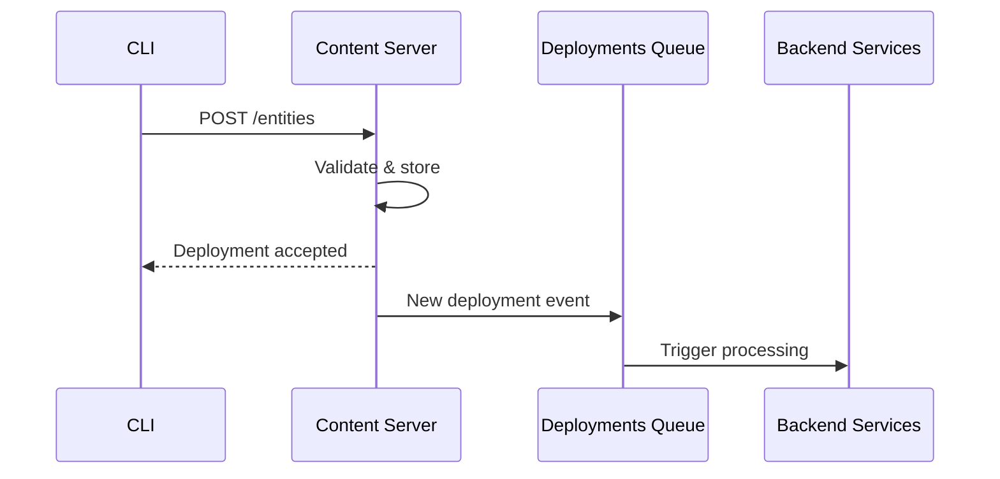
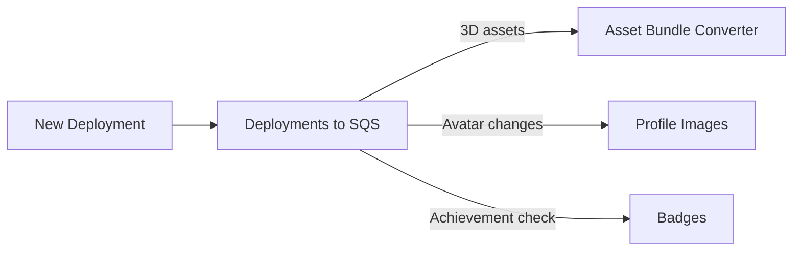
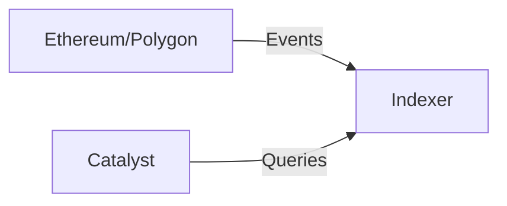

# Red Catalyst

La red Catalyst es la infraestructura de entrega de contenido descentralizada de Decentraland. Múltiples operadores independientes ejecutan nodos Catalyst que almacenan y sirven contenido.

## Resumen

La red Catalyst opera como un sistema distribuido completamente en malla donde los nodos se comunican directamente entre sí para sincronizar contenido y mantener la salud de la red.

## Componentes Catalyst

Cada nodo Catalyst consta de:

### Content Server

**Propósito**: Almacenamiento y recuperación de activos

Almacena y sirve:

* Definiciones de escenas
* Modelos 3D y texturas
* Archivos de audio
* Scripts
* Avatares y wearables

**Referencia de API**: [API Catalyst](../apis/catalyst/)

### Lambdas

**Propósito**: Funciones de consulta sin servidor

Proporciona endpoints consultables:

* Búsquedas de entidades
* Consultas de perfil
* Metadatos de contenido
* Historial de despliegues

Los Lambdas se ejecutan como servicios separados que consultan la base de datos del Content Server.

### Nginx

**Propósito**: Proxy inverso y balanceo de carga

Enruta solicitudes a servicios apropiados:

* Content Server para subidas
* Lambdas para consultas
* Servicio de activos estáticos

***

## Despliegue de Contenido

### Flujo de Despliegue

### Pasos de Despliegue

1. **Compilar**: CLI empaqueta escena usando build-ecs
2. **Firmar**: Creador firma despliegue con wallet
3. **Subir**: CLI sube a cualquier nodo Catalyst
4. **Validar**: Catalyst valida firmas y contenido
5. **Almacenar**: Contenido guardado en almacenamiento
6. **Propagar**: Evento publicado a cola de despliegues
7. **Procesar**: Servicios backend procesan nuevo contenido

### Validación de Contenido

Catalyst valida:

* Firmas digitales (prueba de propiedad)
* Hashes de contenido (integridad)
* Permisos de parcela (propiedad de land)
* Límites de tamaño de archivo
* Cumplimiento de política de contenido

***

## Pipeline de Despliegues

Cuando se despliega contenido, múltiples sistemas reaccionan:

### Procesamiento de Activos

**Servicios Activados**:

* **Asset Bundle Converter** - Crea bundles optimizados
* **Profile Images Producer** - Genera miniaturas de avatar
* **Badges Processor** - Verifica logros de despliegue

### Servicios que Escuchan

Servicios que monitorean despliegues:

* **Worlds** - Para despliegues de world
* **Comms Gatekeeper** - Para configuración de voz de world
* **Atlas Server** - Para actualizaciones de mapa

***

## Replicación de Contenido

Los nodos Catalyst replican contenido para asegurar disponibilidad:

### Estrategia de Replicación

* **Sincronización Activa**: Los nodos sincronizan activamente nuevos despliegues
* **Basado en Pull**: Los nodos obtienen contenido faltante bajo demanda
* **Protocolo Gossip**: Los anuncios de despliegue se propagan

### Direccionamiento de Contenido

Todo el contenido es direccionado por contenido:

* Archivos identificados por CID de IPFS (Content Identifier)
* Inmutable una vez desplegado
* Deduplicación automática

***

## Archipelago Workers (Comms)

La infraestructura de comunicaciones se ejecuta junto a Catalyst:

### Componentes

#### WebSocket Connector

* Mantiene conexiones de cliente
* Manejo de protocolo
* Autenticación de conexión

**Referencia de API**: [API Archipelago Workers](../apis/archipelago-workers/)

#### Archipelago Core

* **Formación de islas** - Agrupa jugadores cercanos
* **Límites de pares** - Aplica máximo de pares por isla (típicamente 100)
* **Actualizaciones de posición** - Transmite posiciones de jugadores
* **Enrutamiento de mensajes** - Enruta chat y emotes

#### Stats Service

* Conteos de usuarios activos por escena
* Estadísticas de conexión
* Métricas de rendimiento

***

## Integración Blockchain

### Subgraph Indexer

Catalyst usa un indexador dedicado:

El **Indexer** indexa:

* Propiedad de land (NFTs LAND)
* Colecciones de Wearables y Emotes
* Registros de nombres
* Transferencias de NFTs

***

## Próximos Pasos

* Revisa [Servicios Backend](services.md) para detalles de servicios
* Ver [Infraestructura](infrastructure.md) para sistemas de soporte
* Consulta [Resumen de Arquitectura](architecture.md) para el panorama completo
