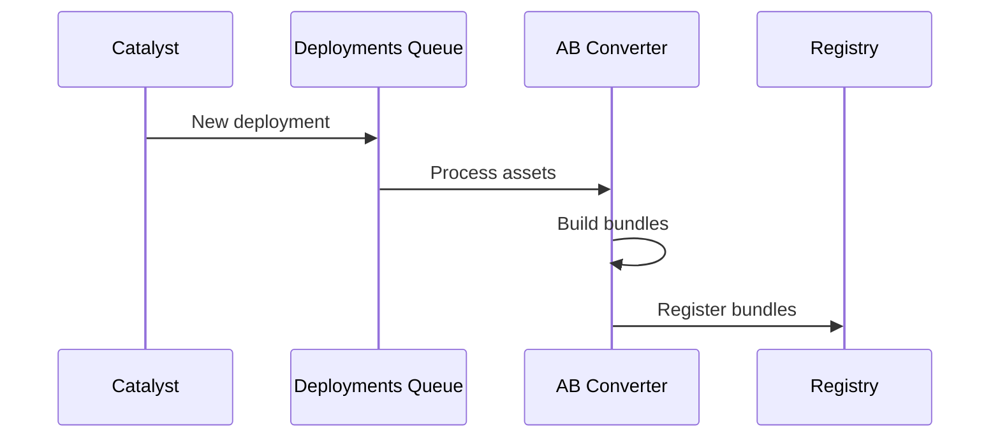
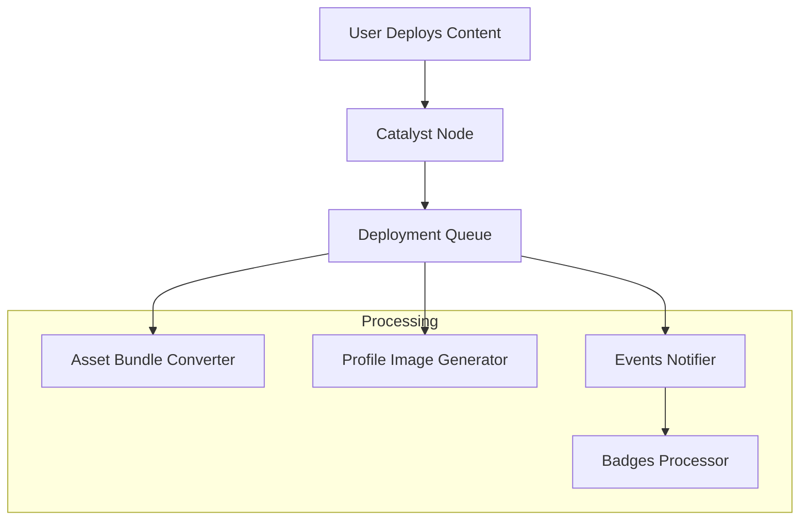

# Servicios Backend

Esta página proporciona un resumen completo de todos los servicios backend de Decentraland, sus roles arquitectónicos y cómo interactúan dentro del ecosistema. Para especificaciones detalladas de API y endpoints, consulta la sección [Referencia de API](../../apis/README.md).

## Arquitectura de Servicios

El backend de Decentraland está compuesto por microservicios distribuidos organizados en capas lógicas:

* **Capa Descentralizada** - Red Catalyst e infraestructura de entrega de contenido
* **Capa de Comunicaciones en Tiempo Real** - Descubrimiento de servicios y comunicaciones peer-to-peer
* **Servicios de Características** - Funcionalidad orientada al usuario (contenido, economía, gamificación)
* **Servicios Core** - Infraestructura esencial de plataforma (auth, marketplace, notificaciones)

***

## Capa Descentralizada

### Catalyst

**Propósito**: Red de entrega de contenido descentralizada

La red Catalyst forma la base de la infraestructura de contenido de Decentraland. Cada nodo Catalyst es un servidor completo que proporciona:

* **Content Server** - Almacenamiento y recuperación de entidades (escenas, perfiles, wearables)
* **Lambdas Service** - Endpoints utilitarios y consultas de contenido
* **Communications Server** - Transporte de mensajes en tiempo real

**Rol Arquitectónico**: Los nodos Catalyst están distribuidos geográficamente y sin permisos. La red proporciona redundancia y disponibilidad de contenido sin control central.

**Integraciones Clave**:
* Realm Provider - Anuncia disponibilidad de nodos
* Asset Bundle Registry - Activa optimización de activos en despliegue
* Archipelago Workers - Proporciona datos de isla/cluster

**Referencia de API**: [API Catalyst](../../apis/catalyst/overview)

### Lamb2

**Propósito**: Utilidades Lambda y funciones sin servidor

Lamb2 proporciona endpoints utilitarios para consumo y consultas de contenido que complementan el Content Server:

* Agregación y filtrado de escenas
* Consultas de perfil con fallbacks
* Verificaciones de estado y salud

**Rol Arquitectónico**: Actúa como una capa de conveniencia sobre el acceso crudo de entidades del Content Server, proporcionando patrones de consulta de nivel superior comúnmente necesarios por clientes.

**Referencia de API**: [API Lamb2](../../apis/lamb2/overview)

***

## Capa de Comunicaciones en Tiempo Real

### Realm Provider

**Propósito**: Descubrimiento de servicios y selección de realm

El Realm Provider es el punto de entrada para todos los clientes de Decentraland. Implementa selección inteligente de realm basada en:

* **Optimización geográfica** - Enruta usuarios a nodos Catalyst más cercanos
* **Monitoreo de salud** - Filtra nodos no saludables o sobrecargados
* **Seguimiento de capacidad** - Proporciona conteos de usuarios en tiempo real por realm
* **Agregación de escenas populares** - Identifica ubicaciones populares en todos los realms

**Rol Arquitectónico**: Fuente única de verdad para infraestructura disponible. Los clientes lo consultan una vez al inicio para descubrir todos los endpoints de servicio (Catalyst, Comms, BFF).

**Integraciones Clave**:
* Consulta todos los nodos Catalyst periódicamente
* Agrega estadísticas de Archipelago
* Proporciona vista unificada de red distribuida

**Referencia de API**: [API Realm Provider](../../apis/realm-provider/overview)

### Comms Gatekeeper

**Propósito**: Control de acceso de voz y video

El Gatekeeper gestiona el acceso a servidores de medios LiveKit para chat de voz y video:

* **Generación de tokens** - Crea tokens de acceso de tiempo limitado con permisos específicos
* **Administración de escena** - Gestiona derechos de admin de escena y baneo
* **Gestión de stream** - Controla acceso de transmisión en vivo y claves RTMP
* **Controles de privacidad** - Aplica permisos de chat de voz privado

**Rol Arquitectónico**: Capa de seguridad entre clientes e infraestructura de medios. Previene acceso no autorizado mientras habilita modelos de permisos flexibles (basado en escena, privado, comunidad).

**Integraciones Clave**:
* LiveKit - Emite tokens JWT para acceso al servidor de medios
* Worlds API - Valida propiedad de world para derechos de admin
* Signed Fetch - Autentica todas las solicitudes a través de firmas de wallet

**Referencia de API**: [API Comms Gatekeeper](../../apis/comms-gatekeeper/overview)

### Archipelago Workers

**Propósito**: Clustering de comunicaciones y enrutamiento de mensajes

Archipelago implementa el protocolo de clustering basado en proximidad que agrupa jugadores cercanos en "islas":

* **Transporte WebSocket** - Mantiene conexiones persistentes con clientes
* **Seguimiento de posición** - Monitorea ubicaciones de jugadores en tiempo real
* **Formación de islas** - Agrupa dinámicamente jugadores basándose en distancia
* **Enrutamiento de mensajes** - Reenvía mensajes solo a miembros de isla

**Componentes Arquitectónicos**:
* **WebSocket Connector** - Maneja conexiones de cliente y autenticación
* **Archipelago Core** - Implementa algoritmo de clustering y gestión de islas
* **Stats Service** - Proporciona métricas de conexión y conteos de usuarios
* **Integración NATS** - Publica actualizaciones de posición y enruta mensajes

**Rol Arquitectónico**: Optimiza comunicaciones peer-to-peer limitando el fanout de mensajes. En lugar de transmitir a todos los usuarios en un realm, los mensajes solo llegan a jugadores dentro del rango de interacción.

**Integraciones Clave**:
* Message broker NATS - Enrutamiento de mensajes distribuido
* Realm Provider - Proporciona estadísticas de isla
* Places API - Datos de conteo de usuarios para escenas populares

**Referencia de API**: [API Archipelago Workers](../../apis/archipelago-workers/overview)

***

## Servicios de Características

### Worlds

**Propósito**: Alojamiento de escenas aisladas fuera de la cuadrícula principal

Worlds permite a los usuarios desplegar escenas en entornos aislados:

* **Worlds Nombrados** - Accesibles a través de URLs personalizadas (ej., `world.dclworlds.com`)
* **Worlds Privados** - Control de acceso con puerta de NFT
* **Permisos de World** - Derechos de admin y despliegue gestionados por propietario

**Rol Arquitectónico**: Extiende el modelo de contenido de Decentraland más allá de la cuadrícula LAND fija. Cada world es una escena independiente con sus propios canales de comunicación y control de acceso.

**Integraciones Clave**:
* Consulta indexadores blockchain para verificación de propiedad de NFT
* Publica actualizaciones de world a NATS para sincronización de cliente en tiempo real
* Se integra con Comms Gatekeeper para salas de chat de voz
* Activa pipeline de procesamiento de activos en despliegue

**Referencia de API**: [API Worlds](../../apis/worlds/overview)

### Events

**Propósito**: Gestión y descubrimiento de eventos en el mundo

Gestiona el ciclo de vida completo de eventos virtuales:

* **CRUD de eventos** - Creación, actualizaciones y programación
* **Seguimiento de asistentes** - Participación de usuarios y RSVPs
* **Descubrimiento** - Consultas basadas en tiempo y filtrado
* **Notificaciones** - Integración con Events Notifier

**Rol Arquitectónico**: Proporciona contexto temporal al metaverso. Los eventos impulsan el descubrimiento y compromiso de usuarios destacando experiencias sensibles al tiempo.

**Referencia de API**: [API Events](../../apis/events/overview)

### Places

**Propósito**: Descubrimiento y curación de puntos de interés

Agrega y cura ubicaciones interesantes en Decentraland:

* **Escenas populares** - Popularidad en tiempo real basada en conteos de usuarios
* **Lugares destacados** - Ubicaciones curadas editorialmente
* **Búsqueda y filtrado** - Descubrimiento por etiquetas, categorías
* **Metadatos de POI** - Descripciones, miniaturas, coordenadas

**Rol Arquitectónico**: Resuelve el problema de descubrimiento en un mundo abierto grande. Agrega datos de múltiples fuentes para ayudar a usuarios a encontrar contenido atractivo.

**Integraciones Clave**:
* Catalyst - Metadatos de escena e información de despliegue
* Archipelago Stats - Conteos de usuarios en tiempo real por escena
* Comms Gatekeeper - Disponibilidad y estado de realm

**Referencia de API**: [API Places](../../apis/places/overview)

### Atlas Server

**Propósito**: Datos de mapa y visualización de parcelas

Proporciona datos completos de mapa del mundo:

* **Propiedad de parcelas** - Datos de LAND indexados de blockchain
* **Metadatos de escena** - Nombres de escenas desplegadas y coordenadas
* **Tiles de mapa** - Imágenes de tiles pre-renderizadas para visualización en IU
* **Consultas espaciales** - Encontrar parcelas por coordenadas o propietario

**Rol Arquitectónico**: Proporciona el índice espacial para la cuadrícula LAND de Decentraland. Esencial para IUs de mapa y navegación espacial.

**Referencia de API**: [API Atlas Server](../../apis/atlas-server/overview)

### Camera Reel

**Propósito**: Gestión de capturas de pantalla generadas por usuario

Gestiona capturas de pantalla e imágenes de usuarios:

* **Subidas de imágenes** - Almacenamiento de imágenes autenticado
* **Organización de galería** - Colecciones de capturas de pantalla de usuario
* **Metadatos** - Ubicación de escena, marca de tiempo, etiquetas

**Rol Arquitectónico**: Habilita características de compartir contenido y sociales en torno a fotografía generada por usuario.

**Referencia de API**: [API Camera Reel](../../apis/camera-reel/overview)

### Exploration Games

**Propósito**: Gamificación de onboarding y tutoriales

Sistema de quests interactivo para onboarding de nuevos usuarios:

* **Seguimiento de quests** - Progreso a través de misiones de tutorial
* **Completación de desafíos** - Verificación de tareas
* **Integración de recompensas** - Se conecta al sistema de recompensas

**Rol Arquitectónico**: Reduce fricción para nuevos usuarios proporcionando introducción estructurada y orientada a objetivos a características de Decentraland.

**Referencia de API**: [API Exploration Games](../../apis/exploration-games/overview)

***

## Servicios Core

### Auth Server

**Propósito**: Autenticación basada en wallet y gestión de sesiones

Implementa el modelo de autenticación wallet-first de Decentraland:

* **Verificación de firma** - Valida firmas de wallet de Ethereum
* **Emisión de token JWT** - Genera tokens de sesión
* **Validación de token** - Verifica tokens para recursos protegidos
* **Ciclo de vida de sesión** - Actualización y expiración de tokens

**Rol Arquitectónico**: Proporciona verificación de identidad descentralizada. Los usuarios se autentican a través de firmas de wallet en lugar de contraseñas, alineándose con principios Web3.

**Flujo de Autenticación**:
1. Cliente solicita desafío
2. Usuario firma desafío con wallet
3. Auth Server verifica firma y emite JWT
4. Cliente incluye JWT en solicitudes API subsiguientes

**Referencia de API**: [API Auth Server](../../apis/auth-server/overview)

### Social Service

**Propósito**: Grafo social y gestión de comunidad

Gestiona relaciones sociales y comunidades:

* **Sistema de amigos** - Solicitudes, aprobaciones, listas de amigos
* **Lista de bloqueo** - Bloqueo de usuarios y privacidad
* **Comunidades** - Membresía de grupo y descubrimiento
* **Estado en tiempo real** - Notificaciones de amigos en línea/fuera de línea a través de NATS
* **Mensajería privada** - Infraestructura de mensajes directos

**Rol Arquitectónico**: Proporciona la capa social que transforma Decentraland de un mundo virtual en un metaverso social.

**Integraciones Clave**:
* Catalyst Client - Obtiene datos de perfil para amigos
* NATS - Publica actualizaciones de estado de amigos
* Archipelago - Consulta estado en línea y ubicaciones

**Referencia de API**: [API Social Service](../../apis/social-service/overview)

### Marketplace Server

**Propósito**: Integración de marketplace NFT

Backend para el marketplace de wearables y emotes de Decentraland:

* **Consultas de listados** - Explorar y buscar artículos del marketplace
* **Historial de transacciones** - Registros de compra
* **Datos de precios** - Precios y tendencias de mercado
* **Metadatos de colecciones** - Colecciones de wearables y emotes

**Rol Arquitectónico**: Conecta datos NFT on-chain con IU de marketplace amigable para el usuario. Indexa eventos blockchain para consultas rápidas.

**Referencia de API**: [API Marketplace Server](../../apis/marketplace-server/overview)

***

## Servicios de Activos

### Asset Bundle Registry

**Propósito**: Gestión de activos optimizados

Registro de bundles de activos optimizados para plataforma:

* URLs de asset bundle por plataforma
* Versionado
* Distribución CDN

**Referencia de API**: [API Asset Bundle Registry](../apis/asset-bundle-registry/)

**Componentes del Sistema**:

* **Asset Bundle Converter** - Construye bundles específicos de plataforma
* **LODs Generator** - Crea variantes de nivel de detalle

**Flujo del Proceso**:

### Camera Reel

**Propósito**: Gestión de capturas de pantalla e imágenes

Gestión de contenido generado por usuario:

* Almacenamiento de capturas de pantalla
* Subidas de imágenes
* Organización de galería

**Referencia de API**: [API Camera Reel](../apis/camera-reel/)

### Credits Server

**Propósito**: Moneda virtual y economía

Gestiona el sistema de créditos virtuales de Decentraland:

* **Seguimiento de saldo** - Saldos de créditos de usuario
* **Libro mayor de transacciones** - Transferencias y gastos de créditos
* **Integración de compra** - Conversión fiat a créditos
* **Sincronización blockchain** - Consulta indexadores para saldos on-chain

**Rol Arquitectónico**: Proporciona una alternativa de moneda de menor fricción a tokens blockchain para compras y características en el mundo.

**Referencia de API**: [API Credits Server](../../apis/credits-server/overview)

### Badges

**Propósito**: Sistema de logros y gamificación

Otorgamiento de insignias impulsado por eventos:

* **Definiciones de insignias** - Logros disponibles
* **Inventario de usuario** - Insignias ganadas por usuario
* **Otorgamiento automático** - Otorgamiento de insignias activado por eventos

**Componentes Arquitectónicos**:
* **Badges API** - Consultas de insignias e inventarios de usuario
* **Badges Processor** - Escucha Events Notifier y otorga insignias

**Rol Arquitectónico**: Gamifica el compromiso de usuario a través de logros. Proporciona visibilidad y reconocimiento para actividades de usuario.

**Referencia de API**: [API Badges](../../apis/badges/overview)

### Rewards API

**Propósito**: Distribución de recompensas NFT basadas en campañas

Gestiona campañas de recompensas NFT promocionales:

* **Gestión de campañas** - Programas de recompensas de tiempo limitado
* **Verificación de elegibilidad** - Verificar calificación de usuario
* **Coordinación de airdrop** - Distribución de NFT a usuarios elegibles
* **Analítica** - Seguimiento de participación en campañas

**Rol Arquitectónico**: Habilita campañas de marketing y adquisición de usuarios a través de recompensas NFT.

**Referencia de API**: [API Rewards](../../apis/rewards/overview)

### Notifications Workers

**Propósito**: Sistema de entrega de notificaciones de usuario

Infraestructura de notificaciones multicanal:

* **Notificaciones in-app** - Consultas de bandeja de notificaciones
* **Notificaciones por email** - Integración SendGrid
* **Notificaciones push** - Alertas móviles y de escritorio
* **Seguimiento de estado de lectura** - Marcar notificaciones como leídas/no leídas

**Componentes Arquitectónicos**:
* **Notifications Inbox** - API para consultar notificaciones de usuario
* **Notifications Processor** - Genera notificaciones de Events Notifier

**Rol Arquitectónico**: Mantiene a usuarios comprometidos a través de alertas oportunas sobre actividad de amigos, eventos, recompensas y actualizaciones del sistema.

**Referencia de API**: [API Notifications Workers](../../apis/notifications-workers/overview)

### Events Notifier

**Propósito**: Bus de eventos para eventos de plataforma

Sistema de publicación de eventos centralizado que activa acciones descendentes:

* **Eventos de usuario** - Login, compras, despliegues
* **Eventos de world** - Actualizaciones de escena, acciones de admin
* **Eventos de sistema** - Mantenimiento, actualizaciones

**Rol Arquitectónico**: Desacopla productores de eventos de consumidores. Los servicios publican eventos sin saber quién los procesa, habilitando arquitecturas extensibles.

**Integraciones Descendentes**:
* Notifications Processor - Crea notificaciones de usuario
* Badges Processor - Otorga insignias de logro
* Rewards API - Rastrea elegibilidad de campaña

**Referencia de API**: [API Events Notifier](../../apis/events-notifier/overview)

***

## Patrones de Interacción de Servicios

### Patrones de Integración Comunes

#### Librería Catalyst Client

Muchos servicios backend usan la librería **Catalyst Client** para interactuar con la red Catalyst descentralizada:

* **Social Service** - Obtiene datos de perfil de usuario
* **Events API** - Consulta metadatos de escena
* **Places** - Agrega información de escena
* **Asset Bundle Registry** - Escucha eventos de despliegue

Esta librería abstrae la lógica de consulta multi-nodo y failover.

#### Message Broker NATS

Actualizaciones en tiempo real y comunicación asíncrona fluyen a través de NATS:

* **Social Service** - Publica cambios de estado de amigos
* **Worlds** - Transmite actualizaciones de configuración de world
* **Archipelago** - Enruta actualizaciones de posición entre islas
* **Events Notifier** - Publica eventos de plataforma

NATS habilita a servicios a comunicarse sin acoplamiento directo.

#### Indexadores Blockchain

Los servicios consultan indexadores (no blockchain directamente) por rendimiento:

* **Worlds** - Verifica propiedad de NFT NAME
* **Atlas** - Obtiene datos de parcela LAND
* **Credits Server** - Verifica saldos de tokens
* **Rewards API** - Verifica condiciones de elegibilidad

Las consultas directas a blockchain serían demasiado lentas para APIs en tiempo real.

### Pipeline de Despliegue de Contenido

Cuando un usuario despliega contenido a Catalyst, múltiples servicios descendentes lo procesan:

**Pasos del Pipeline**:

1. **Catalyst** - Almacena datos crudos de entidad
2. **Deployment Queue** - Activa procesamiento asíncrono
3. **Asset Bundle Converter** - Construye bundles Unity optimizados
4. **Profile Image Generator** - Renderiza miniaturas de avatar (para entidades de perfil)
5. **Events Notifier** - Publica evento de despliegue
6. **Badges Processor** - Verifica insignias de logro de despliegue

### Matriz de Dependencias de Servicios

| Servicio               | Dependencias Core                | Proporciona Datos A              |
| --------------------- | -------------------------------- | -------------------------------- |
| Catalyst              | Ninguna (descentralizado)        | Todos los servicios              |
| Realm Provider        | Catalyst, Archipelago Stats      | Todos los clientes               |
| Auth Server           | Ninguna                          | Todos los servicios protegidos   |
| Archipelago Workers   | NATS, LiveKit                    | Realm Provider, Places           |
| Comms Gatekeeper      | LiveKit, Worlds API              | Clientes (generación de tokens)  |
| Worlds                | Catalyst, NATS, Blockchain       | Gatekeeper, Clientes             |
| Social Service        | Catalyst, NATS, Archipelago      | Clientes                         |
| Places                | Catalyst, Archipelago, Comms     | Clientes                         |
| Events Notifier       | Ninguna                          | Notifications, Badges, Rewards   |
| Asset Bundle Registry | Catalyst, Deployment Queue       | Clientes (activos optimizados)   |
| Notifications Workers | Events Notifier, SendGrid        | Clientes                         |

***

## Documentación Relacionada

### Arquitectura

* [Resumen de Arquitectura](architecture.md) - Arquitectura completa del sistema
* [Red Catalyst](catalyst.md) - Entrega de contenido descentralizada
* [Infraestructura](infrastructure.md) - Sistemas de soporte (NATS, LiveKit, bases de datos)

### Referencias de API

* [Documentación de API](../../apis/README.md) - Especificaciones completas de API
* [Autenticación](../auth/authchain.md) - Flujos de auth basados en wallet
* [Comunicaciones](../comms/overview.md) - Protocolos de mensajería en tiempo real

### Desarrollo

* [Guías del Contribuidor](../contributor-guides/overview.md) - Flujos de trabajo de desarrollo
* [Guía de Pruebas](../practice/testing.md) - Prácticas de pruebas de servicios
