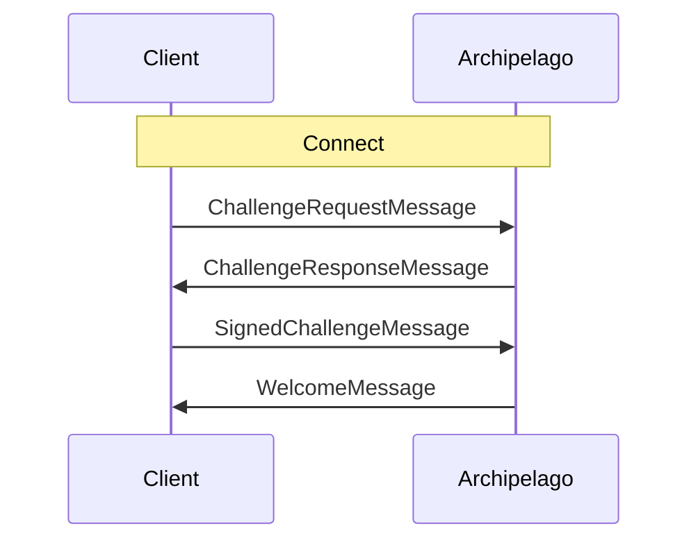

Archipelago es el servicio de realm que agrupa jugadores cercanos en islas, reasignándolos mientras se mueven y proporcionando la información requerida para conectarse al backend real que retransmitirá sus mensajes.


Puedes ver el protocolo Archipelago en acción y experimentar con él usando la [Comms Station](https://decentraland.github.io/comms-station/) de código abierto.


Para usar el servicio, los clientes deben conectarse al endpoint websocket Archipelago de su realm y autenticarse para comenzar su sesión. Luego pueden empezar a enviar actualizaciones posicionales y recibir asignaciones de isla (ver el [ciclo de vida del cliente](overview#lifecycle)).

Todos los mensajes intercambiados con el servicio Archipelago están codificados usando protocol buffers, como se define en el [repositorio de protocolo](https://github.com/decentraland/protocol) de Decentraland.

## Conectando {#connecting}

Para comenzar, los clientes deben abrir una conexión websocket segura (`wss:`) al endpoint `/archipelago/ws` del realm.

Una vez conectados, los clientes tienen una ventana de tiempo definida por política del realm (60 segundos, por defecto) para enviar cada mensaje del flujo de [autenticación](#authenticating).


Mientras los realms más grandes ejecutan el servicio Archipelago, los más pequeños pueden elegir proporcionar una cadena de conexión backend fija para todos los jugadores. El URI, si está presente, puede encontrarse en la propiedad `comms.fixedAdapter` del `/about` del realm.


En estos casos, la asignación dinámica de isla no estará disponible, y la interfaz RPC del realm no debe usarse para ese propósito.

## Autenticando {#authenticating}

Después de abrir una conexión a Archipelago, los clientes deben comenzar solicitando y firmando un desafío del servicio para verificar su identidad.

El primer mensaje que un cliente envía es un [`ChallengeRequestMessage`](ChallengeRequestMessage) con su dirección de Ethereum (es decir, su clave pública). Recibirán un [`ChallengeResponseMessage`](ChallengeResponseMessage) con una cadena generada aleatoriamente para firmar, y deben responder con un [`SignedChallengeMessage`](#SignedChallengeMessage).

El [`SignedChallengeMessage`](#SignedChallengeMessage) lleva una [cadena de autenticación](../auth/authchain) serializada en JSON que comienza con la dirección proporcionada, y termina con la firma del desafío.

Si la firma es verificada exitosamente por el servicio, el cliente está autenticado y recibirá un [`WelcomeMessage`](#WelcomeMessage).



## Enviando Heartbeat {#heartbeat}

Durante su sesión, los clientes deben enviar periódicamente un mensaje [`Heartbeat`](#Heartbeat) para mantener a Archipelago actualizado con la información necesaria para emitir asignaciones de isla.


La frecuencia de heartbeat recomendada para clientes comms es aproximadamente una actualización por segundo.


Si un cliente deja de enviar mensajes [`Heartbeat`](#Heartbeat), Archipelago (dependiendo de su política actual) puede cerrar la conexión.

## Obteniendo Asignaciones de Isla {#assignment}

Poco después del primer heartbeat, Archipelago enviará al cliente su primer [`IslandChangedMessage`][IslandChangedMessage].

El campo principal es `conn_str`, que puede usarse para inicializar un transporte y conectarse a la isla. Los valores típicamente se ven así:

```
livekit:wss://comms.example.com?access_token=eyJhbGciOiJI...
```

La etiqueta antes del primer `:` es el tipo de transporte, el resto es un URI especializado para él. Puede incluir tokens pre-autorizados u otros parámetros.

Durante la sesión, Archipelago puede enviar una nueva asignación en cualquier momento, por varias razones:

1. Cambios de posición: el cliente reportó moverse lejos de otros en la isla.
2. Solicitudes de isla: el cliente solicitó ser asignado a una isla específica.
3. Política de Archipelago: el servicio decidió crear o dividir islas para balancear mejor la población.

Los clientes deben escuchar estas asignaciones, cerrando y abriendo conexiones de transporte como se indica, y cambiando el tipo de transporte en uso cuando se requiera.

## Mensajes de Cliente

##### `ChallengeRequestMessage` <small>[↗ fuente][ChallengeRequestMessage]</small> {#ChallengeRequestMessage}

Enviado por el cliente como el primer mensaje de una sesión, para iniciar el flujo de autenticación.

| Campo     | Tipo     | Valor                    |
| --------- | -------- | ------------------------ |
| `address` | `string` | La dirección del usuario. |

El campo `address` debe derivarse de la primera clave privada de la [cadena de autenticación](../auth/authchain) que se presentará.

---

##### `SignedChallengeMessage` <small>[↗ fuente][SignedChallengeMessage]</small> {#SignedChallengeMessage}

Enviado por el cliente después de recibir un [`ChallengeResponseMessage`](#ChallengeResponseMessage), para completar el flujo de autenticación.

| Campo             | Tipo     | Valor                                                                                                                    |
| ----------------- | -------- | ------------------------------------------------------------------------------------------------------------------------ |
| `auth_chain_json` | `string` | Una [cadena de autenticación](../auth/authchain) serializada en JSON terminando con la firma del desafío. |

La primera clave en la [cadena de autenticación](../auth/authchain) debe corresponder a la dirección enviada en el [`ChallengeRequestMessage`](#ChallengeRequestMessage) original.

---

##### `Heartbeat` <small>[↗ fuente][Heartbeat]</small> {#Heartbeat}

Enviado por el cliente a intervalos regulares (típicamente una vez por segundo), para actualizar a Archipelago sobre su posición y/o solicitar una asignación de isla.

| Campo          | Tipo       | Valor                                                              |
| -------------- | ---------- | ------------------------------------------------------------------ |
| `position`     | `Position` | La posición 3D del cliente en el mapa del mundo                    |
| `desired_room` | `string?`  | El ID de una isla a la que el cliente le gustaría ser asignado    |

El primer mensaje `Heartbeat` que un cliente envía es seguido rápidamente por un [`IslandChangedMessage`](#IslandChangedMessage) de Archipelago. Las actualizaciones subsiguientes, sin embargo, son independientes de asignaciones de isla. Los clientes no deben esperar que un `Heartbeat` sea respondido.

Cuando el parámetro `desired_room` está incluido, el servicio intentará honrar la solicitud, pero una reasignación a esa isla no está garantizada. Depende de la política de Archipelago (ej. límites en población de isla).

## Mensajes de Servidor

##### `ChallengeResponseMessage` <small>[↗ fuente][ChallengeResponseMessage]</small> {#ChallengeResponseMessage}

Enviado por Archipelago en respuesta a un [`ChallengeRequestMessage`](#ChallengeRequestMessage)

| Campo               | Tipo     | Valor                                                                                                      |
| ------------------- | -------- | ---------------------------------------------------------------------------------------------------------- |
| `challenge_to_sign` | `string` | Una cadena generada para firmar y crear una [cadena de autenticación](../auth/authchain) |
| `already_connected` | `bool`   | Si existe una conexión existente para la clave de este usuario                                             |

---

##### `WelcomeMessage` <small>[↗ fuente][WelcomeMessage]</small> {#WelcomeMessage}

Enviado por Archipelago después de autenticación exitosa.

| Campo     | Tipo     | Valor                                                                          |
| --------- | -------- | ------------------------------------------------------------------------------ |
| `peer_id` | `string` | Un identificador único para el cliente autenticado (típicamente su dirección) |

---

##### `IslandChangedMessage` <small>[↗ fuente][IslandChangedMessage]</small> {#IslandChangedMessage}

Enviado por Archipelago cuando el cliente es (re)asignado a una isla.

Descripción.

| Campo            | Tipo                    | Valor                                                                             |
| ---------------- | ----------------------- | --------------------------------------------------------------------------------- |
| `island_id`      | `string`                | El ID de la nueva isla                                                            |
| `from_island_id` | `string?`               | El ID de la isla antigua, si esto es una reasignación                            |
| `conn_str`       | `string`                | La cadena de conexión para el [transporte](transports) de isla.     |
| `peers`          | `map<string, Position>` | Descripción.                                                                      |

Los clientes que reciben un `IslandChangedMessage` deben terminar su conexión al backend de isla, y conectarse al dado en `conn_str`.

El campo `peers` contiene las identidades y posiciones actuales de todos los peers en la isla, para que los clientes puedan poblar su conjunto inicial. Después de este punto, deben confiar en mensajes recibidos a través del [transporte](transports) de isla para obtener actualizaciones posicionales.

---

##### `KickedMessage` <small>[↗ fuente][KickedMessage]</small> {#KickedMessage}

Enviado por Archipelago antes de cerrar una conexión.

| Campo    | Tipo           | Valor                                                 |
| -------- | -------------- | ----------------------------------------------------- |
| `reason` | `KickedReason` | La razón de Archipelago para cerrar la conexión       |

Los valores estándar para el campo `reason` son:

- `KR_NEW_SESSION`: otra conexión se autenticó con la misma clave.

---

##### `JoinIslandMessage` <small>[↗ fuente][JoinIslandMessage]</small> {#JoinIslandMessage}

Enviado por Archipelago cuando un peer es asignado a la isla del cliente.

| Campo       | Tipo     | Valor                                                         |
| ----------- | -------- | ------------------------------------------------------------- |
| `island_id` | `string` | El identificador para la isla                                 |
| `peer_id`   | `string` | El identificador único para el peer (típicamente su dirección) |

El campo `island_id` coincidirá con la asignación actual del cliente.

---

##### `LeftIslandMessage` <small>[↗ fuente][LeftIslandMessage]</small> {#LeftIslandMessage}

Enviado por Archipelago cuando un peer es removido de la isla del cliente.

| Campo       | Tipo     | Valor                                                         |
| ----------- | -------- | ------------------------------------------------------------- |
| `island_id` | `string` | El identificador para la isla                                 |
| `peer_id`   | `string` | El identificador único para el peer (típicamente su dirección) |

El campo `island_id` coincidirá con la asignación actual del cliente.

[WelcomeMessage]: https://github.com/decentraland/protocol/blob/9a568b16b2eafb134177329ba670c1451be8a169/proto/decentraland/kernel/comms/v3/archipelago.proto#L13
[IslandChangedMessage]: https://github.com/decentraland/protocol/blob/9a568b16b2eafb134177329ba670c1451be8a169/proto/decentraland/kernel/comms/v3/archipelago.proto#L17
[LeftIslandMessage]: https://github.com/decentraland/protocol/blob/9a568b16b2eafb134177329ba670c1451be8a169/proto/decentraland/kernel/comms/v3/archipelago.proto#L24
[JoinIslandMessage]: https://github.com/decentraland/protocol/blob/9a568b16b2eafb134177329ba670c1451be8a169/proto/decentraland/kernel/comms/v3/archipelago.proto#L29
[KickedReason]: https://github.com/decentraland/protocol/blob/9a568b16b2eafb134177329ba670c1451be8a169/proto/decentraland/kernel/comms/v3/archipelago.proto#L34
[KickedMessage]: https://github.com/decentraland/protocol/blob/9a568b16b2eafb134177329ba670c1451be8a169/proto/decentraland/kernel/comms/v3/archipelago.proto#LL37C1-L38C1
[ChallengeRequestMessage]: https://github.com/decentraland/protocol/blob/9a568b16b2eafb134177329ba670c1451be8a169/proto/decentraland/kernel/comms/v3/archipelago.proto#L54
[SignedChallengeMessage]: https://github.com/decentraland/protocol/blob/9a568b16b2eafb134177329ba670c1451be8a169/proto/decentraland/kernel/comms/v3/archipelago.proto#L58
[Heartbeat]: https://github.com/decentraland/protocol/blob/9a568b16b2eafb134177329ba670c1451be8a169/proto/decentraland/kernel/comms/v3/archipelago.proto#L62
[ChallengeResponseMessage]: https://github.com/decentraland/protocol/blob/9a568b16b2eafb134177329ba670c1451be8a169/proto/decentraland/kernel/comms/v3/archipelago.proto#L8
