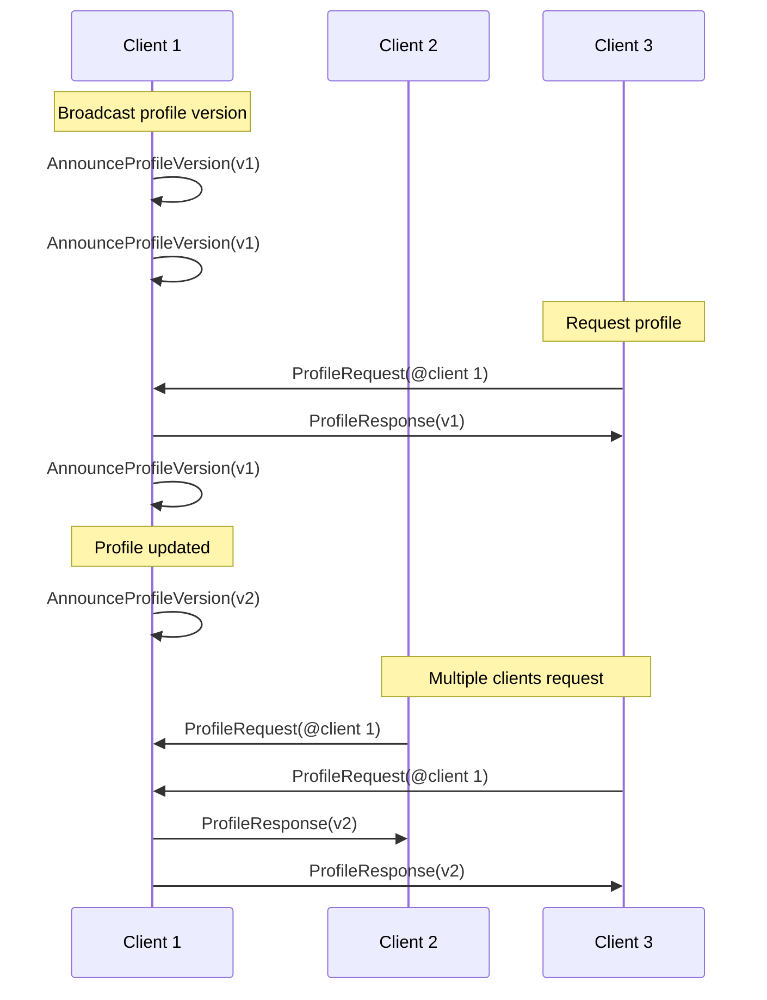

Los mensajes en comms son _paquetes_ de datos binarios, serializados usando [protocol buffers](https://github.com/protocolbuffers/protobuf). Llevan chat de texto y voz, actualizaciones posicionales, cambios de perfil y otras interacciones en tiempo real.


Puedes ver el protocolo comms en acción y experimentar con él usando la [Comms Station](https://decentraland.github.io/comms-station/) de código abierto.


Todas las definiciones de mensajes están disponibles en el [repositorio de protocolo](https://github.com/decentraland/protocol), y cada tipo de mensaje a continuación tiene un enlace a su declaración.

##### `Packet` <small>[↗ fuente][Packet]</small> {#Packet}

La estructura `Packet` es el contenedor para todos los mensajes.

| Campo     | Tipo   | Valor                                                                                                                      |
| --------- | ------ | -------------------------------------------------------------------------------------------------------------------------- |
| `message` | `enum` | Uno de `Chat`, `Voice`, `Position`, `AnnounceProfileVersion`,  `ProfileRequest`, `ProfileResponse`, o `Scene`. |

## Chat de Texto y Voz

Los clientes chatean transmitiendo mensajes de texto y clips de audio a todos los peers conectados (usualmente jugadores en la misma isla).

Solo dos tipos de `Packet` están involucrados, uno para cada caso de uso. En circunstancias típicas, los clientes transmiten estos mensajes a todos los demás clientes en su isla, que es el grupo de jugadores cercanos con los que pueden interactuar.

---

##### `Chat` <small>[↗ fuente][Chat]</small> {#Chat}

Envía un mensaje de chat de texto a otros clientes.

| Campo       | Tipo     | Valor                      |
| ----------- | -------- | -------------------------- |
| `message`   | `string` | Texto del mensaje          |
| `timestamp` | `double` | Marca de tiempo UTC del remitente |

---

##### `Voice` <small>[↗ fuente][Voice]</small> {#Voice}

Envía una muestra de voz codificada a otros clientes.

| Campo             | Tipo     | Valor                                                       |
| ----------------- | -------- | ----------------------------------------------------------- |
| `encoded_samples` | `bytes`  | Datos de audio codificados                                  |
| `codec`           | `enum`   | Solo `VC_OPUS` (ningún otro codec está soportado por ahora) |
| `index`           | `uint32` | Un contador incremental establecido por el remitente        |

El campo `codec` es un valor `enum`. Los codecs personalizados no están soportados.

## Movimiento

Los clientes que controlan avatares envían y reciben actualizaciones posicionales dentro de su isla, para sincronizar movimiento y postura entre jugadores.

---

##### `Position` <small>[↗ fuente][Position]</small> {#Position}

Actualiza a otros clientes sobre la posición y orientación de un avatar.

| Campo                                                        | Tipo     | Valor                                   |
| ------------------------------------------------------------ | -------- | --------------------------------------- |
| `position_x` `position_y` `position_z`                 | `float`  | Posición del avatar en el mapa del mundo |
| `rotation_x` `rotation_y` `rotation_z` `rotation_w` | `float`  | Cuaternión de rotación del avatar        |
| `index`                                                      | `uint32` | Un contador incremental establecido por el remitente |

Los clientes típicamente envían actualizaciones `Position` con baja frecuencia (como una vez cada 1 o 2 segundos), y cambian a alta frecuencia (varias veces por segundo) cuando se mueven o interactúan.


Al enviar actualizaciones posicionales, la velocidad generalmente es mejor que la fiabilidad. El rendimiento percibido es mejor cuando la entrega es más rápida, incluso si un mensaje `Position` se pierde o reordena ocasionalmente. Algunos transportes (ej. [LiveKit](transport-types/livekit)) pueden cambiar entre modos rápido y confiable por mensaje.


Las transmisiones de baja frecuencia se recomiendan como una solución simple para entregar actualizaciones a clientes que momentáneamente perdieron conectividad o no lograron capturar un mensaje mientras se unían a la isla.

El campo `index` es un contador incremental, establecido por el remitente para que los receptores puedan ordenar actualizaciones que llegan fuera de orden.

## Compartir Perfil

Los clientes dentro de una isla pueden solicitar la información de avatar de otros jugadores, para renderizar sus avatares, mostrar sus nombres e imágenes, etc.

Como los cambios de perfil son raros (comparado con actualizaciones posicionales, por ejemplo), el sistema está diseñado para simplificar la tarea de mantener un caché de perfil local, y solo obtener perfiles cuando sea necesario.

Hay 3 tipos de [`Packet`](#Packet) involucrados: un par [`ProfileRequest`](#ProfileRequest)/[`ProfileResponse`](#ProfileResponse) usado por clientes para compartir perfiles bajo demanda, y el mensaje [`AnnounceProfileVersion`](#AnnounceProfileVersion) para decirle a los peers cuál es la última versión, para que puedan decidir si solicitarlo.

Los clientes típicamente transmiten mensajes `AnnounceProfileVersion` periódicamente, además de inmediatamente cuando su perfil cambia.

---

##### `AnnounceProfileVersion` <small>[↗ fuente][AnnounceProfileVersion]</small> {#AnnounceProfileVersion}

Señala a otros clientes que hay una [entidad de perfil](/contributor/content/entity-types/profiles) que pueden solicitar.

| Campo             | Tipo     | Valor                                                    |
| ----------------- | -------- | -------------------------------------------------------- |
| `profile_version` | `uint32` | Un número de versión incrementado con cada modificación. |

Los receptores que almacenan perfiles en caché pueden usar el número `profile_version` para decidir si su copia local está actualizada, o si necesitan enviar un [`ProfileRequest`](#ProfileRequest).

---

##### `ProfileRequest` <small>[↗ fuente][ProfileRequest]</small> {#ProfileRequest}

Solicita un perfil de una versión especificada de un peer particular.

| Campo             | Tipo     | Valor                                   |
| ----------------- | -------- | --------------------------------------- |
| `address`         | string   | La dirección identificadora del perfil. |
| `profile_version` | `uint32` | La versión de perfil deseada.           |

Los receptores pueden responder con mensajes [`ProfileResponse`](#ProfileResponse) para proporcionar el perfil solicitado.

---

##### `ProfileResponse` <small>[↗ fuente][ProfileResponse]</small> {#ProfileResponse}

Envía un perfil en respuesta a un [`ProfileRequest`](#ProfileRequest).

| Campo                | Tipo     | Valor                                                                 |
| -------------------- | -------- | --------------------------------------------------------------------- |
| `serialized_profile` | string   | Entidad de perfil serializada en JSON.                                |
| `base_url`           | `uint32` | URL base para un endpoint de filesystem, recomendado por el remitente. |

El campo `serialized_profile` contiene la serialización JSON de una [entidad de perfil](/contributor/content/entity-types/profiles).

Si el remitente quiere recomendar un servidor de contenido para descargar entidades referenciadas en su perfil (como wearables), puede establecer el campo `base_url` como pista. Los clientes son libres de usar o ignorar esta URL.

<!--
## Mensajes de Escena

##### `Scene` <small>[↗ fuente][Scene]</small> {#Scene}

TODO: Documentar tipo de mensaje Scene
-->

[Packet]: https://github.com/decentraland/protocol/blob/c48ea0aa00d8173084571552463a6a05a7f49636/proto/decentraland/kernel/comms/rfc4/comms.proto#L8
[Position]: https://github.com/decentraland/protocol/blob/c48ea0aa00d8173084571552463a6a05a7f49636/proto/decentraland/kernel/comms/rfc4/comms.proto#L20
[AnnounceProfileVersion]: https://github.com/decentraland/protocol/blob/c48ea0aa00d8173084571552463a6a05a7f49636/proto/decentraland/kernel/comms/rfc4/comms.proto#L34
[ProfileRequest]: https://github.com/decentraland/protocol/blob/c48ea0aa00d8173084571552463a6a05a7f49636/proto/decentraland/kernel/comms/rfc4/comms.proto#L41
[ProfileResponse]: https://github.com/decentraland/protocol/blob/c48ea0aa00d8173084571552463a6a05a7f49636/proto/decentraland/kernel/comms/rfc4/comms.proto#L46
[Chat]: https://github.com/decentraland/protocol/blob/c48ea0aa00d8173084571552463a6a05a7f49636/proto/decentraland/kernel/comms/rfc4/comms.proto#L56
[Scene]: https://github.com/decentraland/protocol/blob/c48ea0aa00d8173084571552463a6a05a7f49636/proto/decentraland/kernel/comms/rfc4/comms.proto#L61
[Voice]: https://github.com/decentraland/protocol/blob/c48ea0aa00d8173084571552463a6a05a7f49636/proto/decentraland/kernel/comms/rfc4/comms.proto#L66
