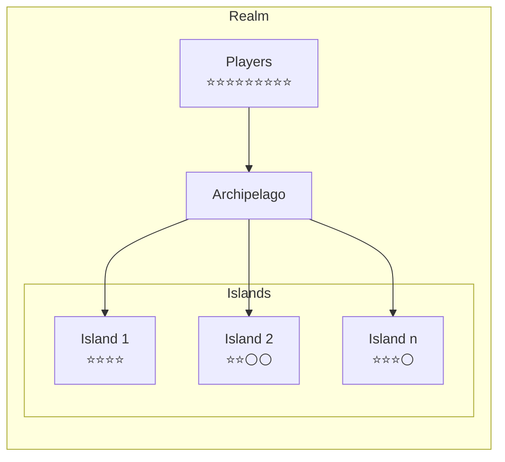
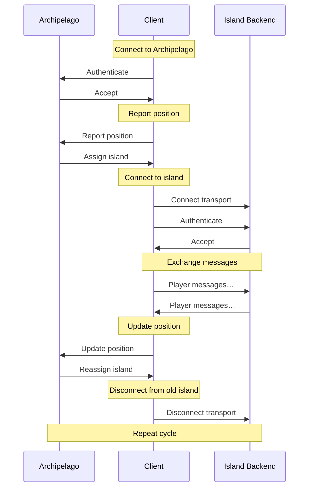

El sistema de comunicaciones de Decentraland, o simplemente _comms_, es el protocolo de mensajería en tiempo real que maneja la interacción entre jugadores en un realm.

Algunas de estas interacciones son iniciadas por jugadores, otras son manejadas automáticamente por clientes bajo el capó. Algunos ejemplos:

* Chat de texto y voz
* Actualizaciones de posición mientras los jugadores se mueven
* Actualizaciones de avatar cuando los jugadores cambian su apariencia


Puedes ver el protocolo comms en acción y experimentar con él usando la [Comms Station](https://decentraland.github.io/comms-station/) de código abierto.


Como la mayoría de esta funcionalidad requiere transmitir mensajes a todos los jugadores cercanos, estos son automáticamente agrupados en clusters basados en proximidad llamados _islas_. Cada jugador es asignado a una sola isla a la vez, que cambia mientras viajan por el mundo y se mueven relativamente a otros.

El servicio de realm que gestiona y asigna jugadores a islas se llama _Archipelago_. Se encarga de crear islas cuando son necesarias, mantener su población en un número razonable y reasignar dinámicamente jugadores en respuesta a sus movimientos.

Cuando son asignados a una isla, los clientes reciben un URI específico de isla para conectarse al backend real que retransmitirá mensajes entre ellos. Esta conexión dura hasta que Archipelago reasigne al cliente a una isla diferente.

Esto significa que, además del protocolo [Archipelago](archipelago), los clientes deben implementar un número de _transportes_, cada uno envolviendo uno de los backends soportados en una interfaz unificada.

## Ciclo de Vida del Cliente {#lifecycle}

El ciclo de vida de un cliente comms puede resumirse en unos pocos pasos:

1. **Seleccionar un realm**: obtener un URI para el servicio [Archipelago](archipelago).
2. **Unirse a Archipelago**: abrir una conexión persistente con el servicio.
3. **Obtener una (re)asignación de isla**: reportar la posición actual y obtener un URI específico de isla.
4. **Conectar un transporte**: abrir una segunda conexión al backend específico de isla.
5. **Repetir**: continuar pasando por los pasos 3 y 4, reportando periódicamente nuevas posiciones.

Cuando el cliente termina su sesión, simplemente se desconecta del servicio Archipelago. Serán automáticamente removidos de su isla actual.

## Conexiones

Las conexiones comms están principalmente basadas en websocket, aunque algunos transportes pueden usar otras estrategias.

Ve a las secciones [Transportes](transports) o [Archipelago](archipelago) para aprender más, o a una página de transporte específica para detalles sobre él.

## Autenticación

Las conexiones a comms son autenticadas haciendo que los clientes firmen un desafío proporcionado por el servidor, usando el esquema descrito en la sección [cadena de autenticación](../auth/authchain).

Dirígete a la página [Archipelago](archipelago) o ve un transporte específico para aprender más sobre flujos de autenticación.

## Islas

Las islas son grupos altamente dinámicos de jugadores que pueden transmitir mensajes entre sí, creados y mantenidos por [Archipelago](archipelago) en respuesta a sus movimientos en el mundo.

No hay un área predefinida o punto central para una isla. No son características geográficas estables, solo asociaciones temporales de jugadores cercanos. Si se puede decir que una isla cubre una región, es solo porque sus miembros actualmente están dispersos en esa zona.

Puede haber cero islas en una región sin jugadores, y varias islas superpuestas en áreas densamente pobladas, donde asignar a todos al mismo grupo haría la transmisión en tiempo real imposible.

Cada servidor en la red de Decentraland puede configurar la población máxima de isla y la distancia a la que se consideran cercanos los jugadores. Por defecto, las islas pueden alojar hasta 100 jugadores dentro de 100 metros entre sí.

El flujo para ser asignado a una isla y unirse a ella está detallado en la sección [Archipelago](archipelago).

## Mensajes

Los mensajes en el protocolo comms son blobs binarios serializados usando [protocol buffers](https://github.com/protocolbuffers/protobuf), envueltos en una estructura [Packet](messages#Packet).


Al usar la palabra _mensaje_ en el contexto de comms, siempre nos estaremos refiriendo al protocolo de mensajes binarios, no a mensajes de chat intercambiados entre jugadores.


Hay varios tipos de mensajes diferentes, para una variedad de flujos de interacción en tiempo real. Dirígete a la sección [mensajes](messages) para aprender más.
