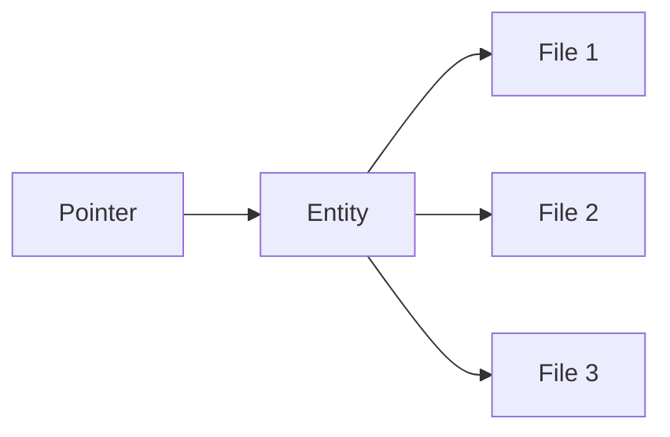

Todo lo que puedes encontrar dentro del mundo virtual de Decentraland está alojado en una red distribuida de servidores conocidos como Catalysts, que proporcionan (entre otras cosas) la API de contenido. Son el medio por el cual los clientes suben y descargan contenido.

La API completa del Catalyst está disponible en [su propia referencia](https://decentraland.github.io/catalyst-api-specs/). Aquí, nos enfocaremos en entender cómo se organiza el contenido, y cómo puede ser descubierto y descargado.

Todos los conceptos importantes mencionados a continuación se describen más ampliamente en sus propias páginas.

## Archivos, Entidades, Punteros

Hay tres capas en el sistema de contenido de Decentraland: los [archivos](../filesystem.md) están empaquetados dentro de [entidades](../entities.md), y las entidades se descubren usando [punteros](../pointers.md).

Los [Archivos](../filesystem.md) se almacenan en un sistema de archivos descentralizado que se asemeja a IPFS, y se sincronizan automáticamente entre servidores de contenido. Se identifican por un ID de cadena único que se calcula del contenido del archivo, y tanto el identificador como el contenido son **inmutables**. No existe tal cosa como actualizar un archivo. En su lugar, se suben archivos de reemplazo y los archivos obsoletos se eliminan.

Las [Entidades](../entities.md) son paquetes atómicos de archivos, y representan contenido real encontrado en el mundo, como escenas y artículos wearables. Tienen al menos un archivo, llamado _manifest_, con una descripción general y metadatos. Al igual que los archivos individuales que contienen, son inmutables e identificados por una cadena única y determinista. Todas las entidades tienen un propietario, quien posee las claves privadas requeridas para gestionarlas.

Los [Punteros](../pointers.md) son referencias estables que pueden resolverse al ID de una entidad. Cuando la entidad es reemplazada (es decir, el propietario sube un nuevo paquete, y el antiguo se elimina), los archivos contenidos y metadatos son diferentes y también lo son sus identificadores, pero los punteros permanecen igual y son redirigidos a la nueva versión.

## Instantáneas

Los servidores de contenido también alojan archivos JSON grandes delimitados por saltos de línea con resúmenes de todas las entidades activas (es decir, aquellas actualmente referenciadas por punteros) en un cierto punto en el tiempo. Estas se llaman [instantáneas](../snapshots.md), y pueden usarse para explorar todo el contenido disponible.
