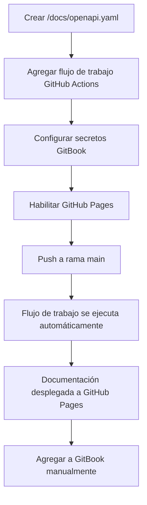
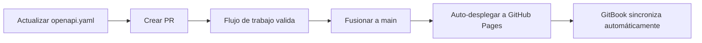

# Estándares de Documentación de API

Esta página cubre los estándares para documentar APIs usando especificaciones OpenAPI a través de todos los servicios de Decentraland.

## Objetivos

Nuestro enfoque de documentación de API asegura:

* **Estandarización** - Especificaciones OpenAPI consistentes a través de todos los servicios
* **Automatización** - Validación, empaquetado y despliegue vía GitHub Actions
* **Centralización** - Toda la documentación de servicios publicada a través de GitBook
* **Propiedad** - La documentación vive con cada repositorio de servicio
* **Accesibilidad** - Referencias de API amigables para contribuidores y actualizadas

---

## Estructura del Repositorio

Cada repositorio de servicio DEBE incluir un directorio `/docs` con la siguiente estructura:

```bash
/docs
  openapi.yaml        # Fuente de verdad (OpenAPI 3.1)
  openapi.json        # Auto-generado en CI para Hugo/renders
  index.html          # Documentación standalone auto-generada (opcional)
```

### Requisitos de Archivos

#### `openapi.yaml`

* **DEBE** ser el archivo fuente canónico
* **DEBE** usar la especificación OpenAPI 3.1
* **PUEDE** tener un prefijo de identificación de servicio (ej., `worlds-openapi.yaml`)
* **PUEDE** dividirse en directorios `components/` o `examples/` si es necesario

#### `openapi.json`

* Auto-generado durante CI/CD
* Usado por Hugo y otros renderizadores
* No editar manualmente

#### `index.html`

* Documentación standalone auto-generada
* Construida usando Redocly
* Desplegada a GitHub Pages

---

## Estándares OpenAPI

Al escribir `openapi.yaml`, seguir estas convenciones para asegurar consistencia y claridad.

### Resumen de Endpoint

**DEBE** reflejar la ruta del endpoint actual:

```yaml
# ✅ Bien: Ruta de endpoint clara
paths:
  /world/{world_name}/about:
    get:
      summary: /world/{world_name}/about
      description: Recupera información sobre un mundo específico
      
# ❌ Mal: Resumen genérico
paths:
  /world/{world_name}/about:
    get:
      summary: Get world info
```

### ID de Operación

**DEBE** incluir el nombre del servicio para unicidad global:

```yaml
# ✅ Bien: ID de operación con prefijo de servicio
operationId: worldsContentServer_getWorldAbout

# ✅ Bien: Otro ejemplo
operationId: socialService_getFriends

# ❌ Mal: Genérico, podría entrar en conflicto
operationId: getAbout
```

**Convención de nomenclatura**: `{serviceName}_{operationDescription}`

* Usar camelCase
* Ser descriptivo pero conciso
* Incluir contexto del método HTTP cuando sea útil (ej., `createUser`, `deleteParcel`)

### Versionado

**DEBE** usar versionado semántico (`MAJOR.MINOR.PATCH`) en `info.version`:

```yaml
openapi: 3.1.0
info:
  title: Worlds Content Server API
  version: 1.2.0  # Versionado semántico
  description: API para gestionar mundos de Decentraland
```

**Reglas de incremento de versión**:
* **MAJOR**: Cambios que rompen compatibilidad (cambios de API incompatibles)
* **MINOR**: Nueva funcionalidad (compatible hacia atrás)
* **PATCH**: Correcciones de bugs (compatible hacia atrás)

### Tags y Agrupación

**DEBE** usar tags para agrupar endpoints relacionados:

```yaml
tags:
  - name: Worlds
    description: Operaciones de gestión de mundos
  - name: Deployments
    description: Operaciones de despliegue de mundos
  - name: Health
    description: Endpoints de verificación de salud

paths:
  /worlds:
    get:
      tags:
        - Worlds
      summary: /worlds
      operationId: worldsContentServer_listWorlds
      
  /worlds/{world_name}/about:
    get:
      tags:
        - Worlds
      summary: /worlds/{world_name}/about
      operationId: worldsContentServer_getWorldAbout
```


Las operaciones se agrupan por tag en la navegación de GitBook. Agrupar endpoints relacionados bajo el mismo tag para mejor organización.


### Ejemplo Completo

```yaml
openapi: 3.1.0
info:
  title: Social Service API
  version: 2.1.0
  description: API para gestionar interacciones sociales en Decentraland
  contact:
    name: Decentraland Contributors
    url: https://decentraland.org

servers:
  - url: https://social.decentraland.org
    description: Servidor de producción
  - url: https://social.decentraland.zone
    description: Servidor de staging

tags:
  - name: Friends
    description: Gestión de amigos
  - name: Blocked Users
    description: Operaciones de bloqueo de usuarios

paths:
  /friends:
    get:
      tags:
        - Friends
      summary: /friends
      operationId: socialService_getFriends
      description: Retorna una lista de los amigos del usuario autenticado
      parameters:
        - name: limit
          in: query
          schema:
            type: integer
            default: 50
            maximum: 100
        - name: offset
          in: query
          schema:
            type: integer
            default: 0
      responses:
        '200':
          description: Respuesta exitosa
          content:
            application/json:
              schema:
                type: object
                properties:
                  friends:
                    type: array
                    items:
                      $ref: '#/components/schemas/Friend'
        '401':
          description: No autorizado

components:
  schemas:
    Friend:
      type: object
      required:
        - address
        - createdAt
      properties:
        address:
          type: string
          description: Dirección Ethereum del amigo
        createdAt:
          type: string
          format: date-time
          description: Cuándo se estableció la amistad
```

---

## Desarrollo Local

### Vista Previa de Documentación Localmente

Usar Redocly CLI para previsualizar su documentación OpenAPI:

```bash
# Construir documentación HTML
yarn redocly build-docs docs/openapi.yaml -o docs/index.html

# Luego abrir docs/index.html en su navegador
```

### Agregar a package.json

Agregar un script de construcción por conveniencia:

```json
{
  "scripts": {
    "build:api": "redocly bundle docs/openapi.yaml -o docs/openapi.json --ext json && redocly build-docs docs/openapi.yaml -o docs/index.html",
    "preview:api": "redocly preview-docs docs/openapi.yaml"
  }
}
```

### Instalar Redocly CLI

```bash
# Usando npm
npm install -g @redocly/cli

# Usando yarn
yarn global add @redocly/cli
```

### Validar Especificación OpenAPI

```bash
# Validar su especificación
redocly lint docs/openapi.yaml

# Empaquetar y validar
redocly bundle docs/openapi.yaml
```

---

## Configuración de Automatización

### Paso 1: Configurar Secretos de GitBook

Para publicar especificaciones de API a GitBook, agregar estos secretos a su repositorio:

**Settings → Secrets and variables → Actions → New repository secret**

| Nombre del Secreto | Descripción | Dónde Encontrar |
|-------------|-------------|---------------|
| `GITBOOK_ORGANIZATION_ID` | Su ID de organización de GitBook | GitBook Settings → Organization |
| `GITBOOK_TOKEN` | Token de API de GitBook | GitBook Settings → API Tokens |


Estos secretos DEBEN configurarse para que el flujo de trabajo automatizado publique a GitBook.


### Paso 2: Agregar Flujo de Trabajo de GitHub Actions

Crear `.github/workflows/build-api-docs.yml` en su repositorio:

```yaml
name: build-app-docs

on:
  push:
    branches: [main]
    paths:
      - 'docs/**'
  pull_request:
    paths:
      - 'docs/**'

jobs:
  build:
    uses: decentraland/platform-actions/.github/workflows/apps-docs.yml@main
    with:
      api-spec-file: 'docs/openapi.yaml'
      output-file: 'docs/index.html'
      output-directory: './docs'
      api-spec-name: '{service-name}-api'  # ej., 'social-service-api'
      node-version: '20'
    secrets: inherit
```

**Parámetros**:

* `api-spec-file`: Ruta a su especificación OpenAPI (usualmente `docs/openapi.yaml`)
* `output-file`: Dónde generar documentación HTML
* `output-directory`: Directorio para archivos de salida
* `api-spec-name`: Nombre único para su especificación de API (usado en GitBook)
* `node-version`: Versión de Node.js a usar

**Este flujo de trabajo:**

1. ✅ Valida la especificación OpenAPI
2. ✅ Empaqueta la especificación en un solo archivo
3. ✅ Construye documentación HTML estática usando Redocly
4. ✅ Despliega automáticamente a GitHub Pages
5. ✅ Publica especificación a GitBook (si los secretos están configurados)

### Paso 3: Habilitar GitHub Pages

Configurar GitHub Pages en su repositorio:

1. Ir a **Settings → Pages**
2. Bajo **Build and deployment**:
   * Establecer **Source** a **GitHub Actions**
3. Asegurar que exista un environment llamado **github-pages**
4. Guardar configuración

Después de la primera ejecución exitosa del flujo de trabajo, su documentación estará disponible en:

* **HTML Docs**: `https://decentraland.github.io/<repo>/index.html`
* **OpenAPI Spec**: `https://decentraland.github.io/<repo>/openapi.yaml`
* **Bundled JSON**: `https://decentraland.github.io/<repo>/openapi.json`


Estas URLs permanecen válidas mientras el repositorio exista y GitHub Pages esté habilitado.


---

## Agregar a GitBook

Una vez que su documentación de API esté desplegada, agregarla a la documentación centralizada de GitBook.

### Adición Manual (Proceso Actual)

1. Navegar al espacio de GitBook
2. Ir a la sección **API Reference**
3. Hacer clic en **Add API Reference**
4. Ingresar los detalles de su servicio:
   * **Name**: Nombre de su servicio (ej., "Social Service")
   * **OpenAPI URL**: `https://decentraland.github.io/{repo-name}/openapi.yaml`
5. Guardar

### Características de Integración con GitBook

GitBook automáticamente:

* Parseará su especificación OpenAPI
* Generará documentación de API interactiva
* Creará navegación de endpoints basada en tags
* Proporcionará funcionalidad "Try it"
* Mantendrá documentación sincronizada cuando actualice la especificación

---

## Flujo de Configuración Completo

### Configuración Inicial



### Actualizaciones Continuas



---

## Mejores Prácticas

### Calidad de Documentación

* **Ser descriptivo**: Escribir resúmenes y descripciones claros
* **Proporcionar ejemplos**: Incluir ejemplos de solicitud/respuesta
* **Documentar errores**: Describir todas las respuestas de error posibles
* **Usar componentes**: Reusar esquemas vía `$ref` para evitar duplicación
* **Agregar descripciones**: Cada parámetro, propiedad y respuesta debería tener una descripción

### Ejemplo con Mejores Prácticas

```yaml
paths:
  /users/{address}/friends:
    get:
      tags:
        - Friends
      summary: /users/{address}/friends
      operationId: socialService_getUserFriends
      description: |
        Recupera una lista paginada de amigos para el usuario especificado.
        Retorna direcciones de amigos y metadata incluyendo cuándo se estableció la amistad.
      parameters:
        - name: address
          in: path
          required: true
          description: Dirección Ethereum del usuario (con prefijo 0x)
          schema:
            type: string
            pattern: '^0x[a-fA-F0-9]{40}$'
          example: '0x1234567890abcdef1234567890abcdef12345678'
        - name: limit
          in: query
          description: Número máximo de amigos a retornar (1-100)
          schema:
            type: integer
            minimum: 1
            maximum: 100
            default: 50
        - name: offset
          in: query
          description: Número de amigos a omitir para paginación
          schema:
            type: integer
            minimum: 0
            default: 0
      responses:
        '200':
          description: Lista de amigos recuperada exitosamente
          content:
            application/json:
              schema:
                $ref: '#/components/schemas/FriendsResponse'
              example:
                friends:
                  - address: '0xabcdef...'
                    createdAt: '2024-01-15T10:30:00Z'
                total: 42
                offset: 0
                limit: 50
        '400':
          description: Formato de dirección inválido
          content:
            application/json:
              schema:
                $ref: '#/components/schemas/Error'
              example:
                error: 'Invalid address format'
                code: 'INVALID_ADDRESS'
        '404':
          description: Usuario no encontrado
          content:
            application/json:
              schema:
                $ref: '#/components/schemas/Error'
```

### Reutilización de Esquemas

```yaml
components:
  schemas:
    Error:
      type: object
      required:
        - error
        - code
      properties:
        error:
          type: string
          description: Mensaje de error legible por humanos
        code:
          type: string
          description: Código de error legible por máquina
        details:
          type: object
          description: Contexto de error adicional
          
    PaginatedResponse:
      type: object
      required:
        - offset
        - limit
        - total
      properties:
        offset:
          type: integer
          description: Número de elementos omitidos
        limit:
          type: integer
          description: Elementos máximos por página
        total:
          type: integer
          description: Número total de elementos disponibles
```

### Esquemas de Seguridad

```yaml
components:
  securitySchemes:
    BearerAuth:
      type: http
      scheme: bearer
      bearerFormat: JWT
      description: Token JWT obtenido del endpoint de autenticación

security:
  - BearerAuth: []
```

---

## Validación y Verificaciones de Calidad

### Validación Pre-Commit

Agregar un hook pre-commit o verificación de CI:

```yaml
# .github/workflows/validate-api-spec.yml
name: Validate API Spec

on: [pull_request]

jobs:
  validate:
    runs-on: ubuntu-latest
    steps:
      - uses: actions/checkout@v3
      - uses: actions/setup-node@v3
        with:
          node-version: '20'
      - run: npm install -g @redocly/cli
      - run: redocly lint docs/openapi.yaml
```

### Reglas de Validación Comunes

* Todas las rutas tienen IDs de operación
* Todas las operaciones tienen tags
* Todos los parámetros tienen descripciones
* Todas las respuestas están documentadas
* Se proporcionan ejemplos
* Los esquemas están correctamente referenciados

---

## Solución de Problemas

### El Flujo de Trabajo Falla

**Problema**: El flujo de trabajo de GitHub Actions falla

**Soluciones**:
* Verificar logs del flujo de trabajo para errores de validación
* Ejecutar `redocly lint docs/openapi.yaml` localmente
* Verificar rutas de archivo en configuración del flujo de trabajo
* Asegurar que los secretos estén correctamente configurados

### GitHub Pages No Funciona

**Problema**: La documentación no aparece en la URL de GitHub Pages

**Soluciones**:
* Verificar que GitHub Pages esté habilitado en configuración del repositorio
* Verificar que el flujo de trabajo se completó exitosamente
* Esperar unos minutos para que GitHub Pages se actualice
* Verificar que el environment `github-pages` existe

### GitBook No Se Sincroniza

**Problema**: GitBook no muestra documentación de API actualizada

**Soluciones**:
* Verificar que los secretos de GitBook sean correctos
* Verificar que la URL de OpenAPI sea accesible
* Activar manualmente una actualización en GitBook
* Verificar que la especificación OpenAPI sea válida

---

## Migración desde Documentación Existente

Si tiene documentación de API existente:

1. **Exportar a OpenAPI**: Convertir documentación existente a formato OpenAPI 3.1
2. **Validar**: Usar `redocly lint` para asegurar cumplimiento
3. **Agregar flujo de trabajo**: Configurar automatización de GitHub Actions
4. **Probar**: Verificar que la documentación se construya y despliegue correctamente
5. **Actualizar enlaces**: Apuntar enlaces de documentación antigua a nueva URL de GitHub Pages
6. **Archivar documentación antigua**: Mantener documentación antigua para referencia durante transición

---

## Próximos Pasos

* Revisar los estándares de [Well-Known Components](well-known-components/) para implementación de API
* Ver [Estándares de Pruebas](testing-standards/) para guías de pruebas de API
* Revisar ejemplos de API existentes en la sección [API Reference](https://docs.decentraland.org)

## Recursos

* **OpenAPI Specification**: [spec.openapis.org](https://spec.openapis.org/oas/latest.html)
* **Redocly CLI**: [redocly.com/docs/cli](https://redocly.com/docs/cli/)
* **Integración de API GitBook**: [docs.gitbook.com](https://docs.gitbook.com)
* **Repositorio Platform Actions**: [github.com/decentraland/platform-actions](https://github.com/decentraland/platform-actions)
