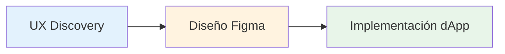

# Resumen del Proceso

Nuestro proceso de desarrollo asegura que lo que se diseña es lo que se construye. El trabajo fluye a través de tres etapas distintas con entregables claros y responsabilidades en cada paso.

## Etapas del Flujo de Trabajo



Cada etapa se construye sobre la anterior, asegurando alineación desde el concepto hasta el código.

***

## UX Discovery

La etapa UX establece la base para todo lo que sigue. Requisitos claros en esta etapa previenen cambios costosos más adelante.

### Entregables Requeridos

#### Objetivo y Alcance

**DEBE** definir:

* **Objetivo de negocio** - ¿Qué problema estamos resolviendo?
* **Usuario objetivo** - ¿Para quién es esto?
* **Métricas de éxito** - ¿Cómo medimos el éxito?
* **Restricciones** - Limitaciones técnicas, de línea de tiempo o recursos

**Ejemplo**:

```
Objetivo: Permitir a los usuarios navegar y filtrar sus parcelas de tierra eficientemente
Objetivo: Propietarios de tierra con 10+ parcelas
Éxito: 80% de usuarios pueden encontrar una parcela específica en menos de 10 segundos
Restricciones: Debe funcionar en móvil; no se permiten cambios en el backend
```

#### Flujos de Interacción

**DEBE** mapear recorridos de usuario de extremo a extremo:

* **Todos los casos de uso** - Caminos de usuario primarios y secundarios
* **Casos extremos** - Estados vacíos, usuarios primerizos, errores
* **Caminos alternos** - Diferentes formas de lograr objetivos
* **Ayudas visuales** - Wireframes o diagramas de flujo cuando sea útil

**Ejemplo**:

```
Flujo Principal:
1. Usuario hace clic en "My Land"
2. Sistema carga parcelas
3. Usuario aplica filtro
4. Resultados se actualizan inmediatamente

Casos Extremos:
- Usuario no tiene parcelas → Mostrar estado vacío con CTA
- Filtro no retorna resultados → Mostrar mensaje "sin resultados"
- La carga toma >2s → Mostrar skeleton loaders
```

#### Estados de IU

**DEBERÍA** especificar todos los estados de componentes:

* **Idle** - Estado por defecto
* **Loading** - Obtención o procesamiento de datos
* **Error** - Operaciones fallidas
* **Empty** - No hay datos disponibles
* **Success** - Operaciones exitosas
* **Disabled** - Acciones no disponibles

**DEBERÍA** delinear recuperación de errores:

* ¿Qué pasa cuando ocurre un error?
* ¿Cómo pueden los usuarios reintentar o resolverlo?
* ¿Qué información necesitan los usuarios?

#### Seguimiento de Analytics

**DEBE** acordar seguimiento en esta etapa:

* **Eventos** - Qué acciones rastrear
* **Propiedades** - Qué datos capturar
* **Propiedades de usuario** - Atributos de usuario relevantes
* **Objetivos de conversión** - Métricas clave de éxito

**Ejemplo**:

```
Eventos:
- parcel_filter_applied { filter_type, filter_value }
- parcel_selected { parcel_id, source }
- parcel_transfer_initiated { parcel_id }

Propiedades:
- user_parcel_count
- filter_used (boolean)
- time_to_result (ms)
```

### Entregables Recomendados

#### Intención de Accesibilidad

**DEBERÍA** describir:

* **Flujos de teclado** - Orden de tabulación y atajos
* **Orden de foco** - Progresión de foco lógica
* **Etiquetas de lector de pantalla** - Etiquetas y descripciones ARIA
* **Contenido alternativo** - Texto para imágenes, íconos, gráficos

**Ejemplo**:

```
Navegación por Teclado:
- Tab: Navegar a través de filtros
- Enter: Aplicar filtro seleccionado
- Escape: Cerrar dropdown de filtro
- Teclas de flecha: Navegar opciones de filtro

Lector de Pantalla:
- "Filtrar por: Dirección del propietario. Escribe para buscar o selecciona de la lista"
- "3 parcelas encontradas que coinciden con tus filtros"
```

#### Legibilidad de Accesibilidad

**DEBERÍA** asegurar:

* **Contraste de color** - Ratios mínimos WCAG AA
  * Texto normal: 4.5:1
  * Texto grande (18pt+): 3:1
  * Componentes UI: 3:1
* **Tamaño de texto** - Legible en tamaños por defecto
* **Objetivos interactivos** - Objetivos táctiles mínimos de 44×44px

#### Elementos Interactivos de IU

**DEBERÍA** definir estados para todos los elementos interactivos:

* **Enabled** - Estado interactivo por defecto
* **Disabled** - Estado no interactivo
* **Hover** - Mouse sobre (escritorio)
* **Pressed/Active** - Durante interacción
* **Focus** - Estado de foco de teclado

**DEBERÍA** especificar retroalimentación de usuario:

* Cambios visuales en interacción
* Indicadores de carga
* Mensajes de éxito/error
* Retroalimentación háptica (móvil)

***

## Diseño Figma

Los diseñadores DEBEN comenzar desde nuestra [biblioteca Figma](https://www.figma.com/design/tsyaDSedcsVZ8iM9N0McT2/DCL-UI2), que refleja componentes Material UI y usa el tema Decentraland definido en UI2.


Colores, tamaños o estilos especiales NO DEBERÍAN usarse. Pueden existir excepciones pero DEBEN justificarse en la especificación y aprobarse durante la revisión.


### Estándares Requeridos

#### Usar Biblioteca Figma de Decentraland

**DEBE** usar componentes MUI cuando existe un equivalente:

* Verificar biblioteca de componentes MUI primero
* Usar variantes y estilos de Decentraland
* No crear versiones personalizadas de componentes existentes

**Si un elemento UI requerido no existe:**

1. Verificar si puede componerse desde componentes existentes
2. Si no, proponer un componente personalizado (ver [Componentes Personalizados](../../../contributor/contributor-guides/web-ui-standards/custom-components.md))
3. Documentar la razón en la especificación
4. Obtener aprobación durante revisión de diseño

#### Colores

**DEBE** coincidir estilos de color de Figma con nombres de tema UI2:

```tsx
import { dclColors } from 'decentraland-ui2';

// Figma "Rarity / Unique" → Código
dclColors.rarity.unique

// Figma "Primary / Main" → Código
theme.palette.primary.main

// Figma "Text / Secondary" → Código
theme.palette.text.secondary
```

**Fuente de verdad**: [colors.ts](https://github.com/decentraland/ui2/blob/master/src/theme/colors.ts)

#### Tipografía

**DEBE** usar variantes definidas:

Variantes disponibles:

* `h1`, `h2`, `h3`, `h4`, `h5`, `h6` - Encabezados
* `subtitle1`, `subtitle2` - Subencabezados
* `body1`, `body2` - Texto de cuerpo
* `button` - Texto de botón
* `caption` - Subtítulos
* `overline` - Texto overline

**Referencias**:

* [Fuente de tipografía](https://github.com/decentraland/ui2/blob/master/src/theme/typography.ts)
* [MUI Typography](https://mui.com/material-ui/react-typography/)
* [Sistema de Tipo Material Design](https://m2.material.io/design/typography/the-type-system.html#type-scale)

**Ejemplo de mapeo**:

```
Figma "H1" → <Typography variant="h1">
Figma "Body 1" → <Typography variant="body1">
Figma "Caption" → <Typography variant="caption">
```

#### Breakpoints

**DEBE** diseñar para estos breakpoints:

| Nombre | Ancho  | Dispositivo Típico |
| ------ | ------ | ------------------ |
| `xs`   | 768px  | Móvil              |
| `sm`   | 991px  | Tablet             |
| `md`   | 1024px | Escritorio Pequeño |
| `lg`   | 1280px | Escritorio         |
| `xl`   | 1500px | Escritorio Grande  |

**Fuente**: [index.ts](https://github.com/decentraland/ui2/blob/master/src/theme/index.ts)

**Mejores prácticas**:

* Diseñar mobile-first (empezar en `xs`)
* Mostrar breakpoints clave en frames de Figma
* Documentar comportamiento responsivo
* Probar en bordes de viewport (767px, 768px, etc.)

#### Border Radius y Paletas

**DEBE** usar valores definidos por el tema:

* No introducir nuevos valores de border radius
* No crear nuevos roles de paleta
* Las excepciones requieren justificación en especificación y aprobación

**Valores de tema**:

```tsx
theme.shape.borderRadius // Radio por defecto
theme.palette.primary    // Colores primarios
theme.palette.secondary  // Colores secundarios
theme.palette.error      // Colores de error
theme.palette.text       // Colores de texto
theme.palette.background // Colores de fondo
theme.palette.divider    // Colores de divisor
```

#### Esquemas de Color

**Si la pantalla soporta múltiples esquemas de color:**

**DEBE** proporcionar:

* Qué esquema aplica (ver [colorSchemes.ts](https://github.com/decentraland/ui2/blob/master/src/theme/colorSchemes.ts))
* Vista previa del modo claro
* Vista previa del modo oscuro
* Documentación sobre cambio de esquemas en Storybook

**Ejemplo**:

```
Esquemas Soportados: Claro, Oscuro
Por defecto: Preferencia del sistema
Toggle: Menú de configuración → Apariencia
Storybook: Usar control "Theme" en la barra de herramientas
```

### Selección de Componentes

**DEBERÍA** reusar componentes preparados:

1. **Verificar MUI primero** - ¿MUI tiene este componente?
2. **Verificar UI2** - ¿Hay una variante de Decentraland?
3. **Componer si es posible** - ¿Puedes combinar componentes existentes?
4. **Personalizado como último recurso** - Seguir proceso de [Componentes Personalizados](../../../contributor/contributor-guides/web-ui-standards/custom-components.md)

***

## Implementación dApp

Los desarrolladores implementan diseños usando componentes UI2 y siguiendo nuestros estándares de [Estilos y Tematización](../../../contributor/contributor-guides/web-ui-standards/styling-and-theming.md).

### Lista de Verificación de Implementación

* [ ] Empezar con componente UI2 si está disponible
* [ ] Usar componente MUI con tema Decentraland si no hay equivalente UI2
* [ ] Seguir estándares de [Estilos y Tematización](../../../contributor/contributor-guides/web-ui-standards/styling-and-theming.md)
* [ ] Implementar todos los estados de la especificación UX
* [ ] Agregar seguimiento de analytics como se especificó
* [ ] Probar en todos los breakpoints
* [ ] Verificar navegación por teclado
* [ ] Verificar contraste de color
* [ ] Probar con lector de pantalla
* [ ] Manejar estados de carga y error
* [ ] Agregar a Storybook si es un componente reutilizable

### Flujo de Implementación de Componentes

```
1. Verificar UI2 para componente
   ↓
2. ¿Encontrado? → Usarlo
   ↓
3. ¿No encontrado? → Verificar MUI
   ↓
4. ¿Encontrado en MUI? → Usar con tema Decentraland
   ↓
5. ¿Necesitas personalización? → Ver guía de Componentes Personalizados
   ↓
6. Implementar siguiendo estándares de Estilos
   ↓
7. Agregar a Storybook (si es reutilizable)
```

### Puertas de Calidad

Antes de marcar la implementación como completa:

1. **Coincidencia visual** - Coincide con Figma pixel-perfect en breakpoints clave
2. **Cumplimiento de tema** - Todos los valores del tema UI2
3. **Estados implementados** - Todos los estados especificados en UX funcionan
4. **Accesibilidad** - Navegación por teclado, estados de foco, etiquetas ARIA
5. **Analytics** - Los eventos se disparan como se especificó
6. **Responsivo** - Funciona en todos los breakpoints
7. **Rendimiento** - Sin re-renders innecesarios
8. **Pruebas** - Las pruebas de componentes pasan
9. **Storybook** - Historias agregadas (si es reutilizable)
10. **Revisión de código** - Aprobado por maintainers

***

## Mejores Prácticas de Handoff

### De UX a Diseño

* Documento de requisitos claro
* Flujos de usuario con anotaciones
* Diagramas de estado para interacciones complejas
* Especificaciones de eventos de analytics

### De Diseño a Desarrollo

* Archivo Figma con modo dev habilitado
* Especificaciones de componentes
* Notas de comportamiento responsivo
* Mapeo de tokens de color y tipografía
* Anotaciones de accesibilidad
* Enlace a requisitos UX

### Durante la Implementación

* Check-ins regulares entre diseñador y desarrollador
* Retroalimentación temprana sobre restricciones técnicas
* Revisiones iterativas en hitos clave
* Revisión final antes de fusionar

***

## Próximos Pasos

* Aprender sobre [Componentes Personalizados](../../../contributor/contributor-guides/web-ui-standards/custom-components.md) para crear nuevos componentes
* Revisar [Estilos y Tematización](../../../contributor/contributor-guides/web-ui-standards/styling-and-theming.md) para detalles de implementación
* Ver [Guía de Migración](../../../contributor/contributor-guides/web-ui-standards/migration.md) si trabajas con componentes UI1
