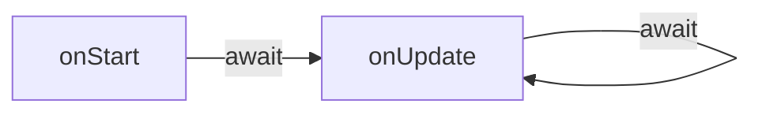

El runtime trata a las [escenas](..//contributor/content/entity-types/scenes.md) como módulos típicos de Node. Una vez que el sandbox está configurado (es decir, todos los [globales](../globals.md) están inyectados y los [módulos](../modules.md) están listos para ser cargados), el código de la escena será evaluado para que pueda poblar el objeto [exports](../globals.md#module).

Dos métodos serán recogidos por el host desde `exports`: [`onStart`](#onStart) (opcional) y [`onUpdate`](#onUpdate) (obligatorio).

```ts
type Exports = {
  onStart?: () => Promise<void>;
  onUpdate: (deltaSeconds: number) => Promise<void>;
};
```

Durante el ciclo de vida de una escena, el runtime asegurará que las llamadas a estos métodos nunca se hagan concurrentemente. El `Promise` devuelto siempre será awaited antes de que la escena reciba una nueva llamada.




La sincronización efectiva y eficiente entre escenas individuales y el motor de renderizado del juego es un asunto complicado. Puedes encontrar lecciones de la implementación de la Foundation en [ADR-148](https://adr.decentraland.org/adr/ADR-148).


##### `onStart` {#onStart}

El ciclo de vida de una escena comienza con el método asíncrono `onStart`. Es el lugar para hacer inicializaciones únicas que deben completarse antes de que se haga la primera llamada a [`onUpdate`](#onUpdate).

```ts
onStart(): Promise<void>
```

Las escenas deben usar esta llamada para solicitar cualquier estado preexistente del runtime (como las [entidades básicas](../entities.md)) y realizar su propia configuración inicial.

Exportar `onStart` es recomendado para todas las escenas (y hecho automáticamente cuando se usa el SDK), pero no es requerido por protocolo. El método puede estar faltando, o devolver un `Promise` inmediatamente resuelto.

##### `onUpdate` {#onUpdate}

Mientras una escena está activamente ejecutándose, el método asíncrono `onUpdate` será invocado periódicamente por el runtime para reportar el paso del tiempo. Este es el corazón de la escena: en cada llamada sucesiva, las entidades pueden actualizarse, la entrada procesarse, animaciones reproducirse, mensajes enviarse, UI mostrarse, etc.

```ts
onUpdate(deltaSeconds: number): Promise<void>
```

El parámetro `deltaSeconds` es el número fraccionario de segundos transcurridos desde que la última llamada a `onUpdate` fue iniciada por el runtime (independientemente de cuándo se resolvió el `Promise` devuelto). Esto es específico para cada escena en ejecución.

Como las llamadas a `onUpdate` nunca se superpondrán, la secuencia de `deltaSeconds` produce una línea de tiempo coherente.

En circunstancias ideales, las escenas tienen la oportunidad de ejecutar `onUpdate` antes de que se renderice cada frame. Sin embargo, dependiendo de los recursos disponibles, las escenas ejecutando una carga de trabajo pesada pueden no resolver su `Promise` a tiempo para el siguiente frame. Cada escena es independiente en este respecto: implementaciones ligeras de `onUpdate` pueden ser invocadas múltiples veces en el mismo período que una sola llamada que consume tiempo en otra escena.

Ver [ADR-148](https://adr.decentraland.org/adr/ADR-148) para detalles.

## Running Multiple Scenes

El World Explorer no solo debe soportar ejecutar varias escenas en sandbox, debería hacerlo en todo momento. Hay dos razones para esto:

Primero, cuando los jugadores exploran el mundo, su vista alcanza más allá de los límites geográficos de la escena en la que están parados. Las escenas cercanas (hasta una distancia arbitraria o configurable) deben estar ejecutándose para generar el contenido que los jugadores deberían poder ver.

Segundo, las escenas no solo se ejecutan dentro de sus propios límites no superpuestos. También pueden estar en capas una encima de la otra, afectando el área alrededor del jugador pero proporcionando diferente funcionalidad.

Este es el caso de dos tipos de escenas en particular: la escena de avatar, y experiencias portátiles.

### The Avatar Scene {#avatarScene}

Desde el momento en que el jugador entra al mundo, una escena global encargada de renderizar los avatares de otros jugadores comienza a ejecutarse.

Esta escena no está limitada por límites geográficos, y puede mostrar sus entidades (así como widgets de UI para comunicación) independientemente de la ubicación del jugador.

### Portable Experiences

Decentraland permite que los wearables tengan su propio comportamiento, que se ejecuta en su propio contexto de escena. Estas escenas están centradas alrededor del jugador, y pueden enriquecer la experiencia agregando entidades o mostrando widgets de UI.

Comienzan a ejecutarse cuando el wearable es equipado, y se detienen cuando es removido.
