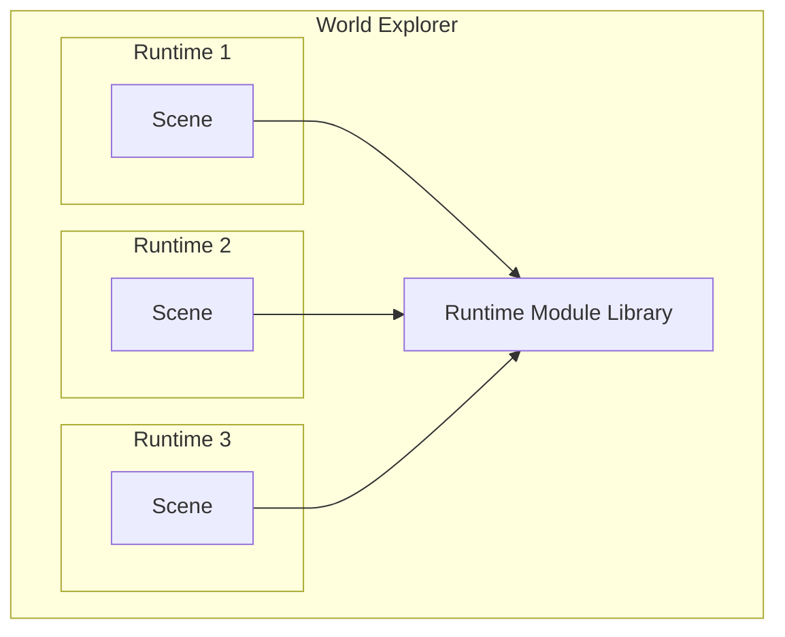

El runtime de escena de Decentraland es el entorno de ejecución en sandbox donde una [escena](../../content/entity-types/scenes.md) ejecuta su script principal.

Cada escena se ejecuta dentro de su propio runtime aislado. Dentro de él, tiene acceso a ciertos [objetos globales](../globals.md) y puede importar [módulos](../modules.md) de la biblioteca del runtime.

Al importar módulos de la biblioteca del runtime, las escenas tienen acceso a una amplia gama de funcionalidades, incluyendo:

- Crear entidades y controlar su comportamiento
- Interactuar con el jugador
- Comunicarse con otros jugadores
- Inspeccionar el estado del mundo
- Conectarse a servicios externos
- Hacer pagos web3

En la práctica, las escenas empaquetan el [SDK de Decentraland](..//creator/sdk7/getting-started/sdk-101.md) con su código, que encapsula la interfaz estilo RPC de la biblioteca del runtime y proporciona una API más agradable y cómoda.


Ten en cuenta que el SDK _no_ es parte del protocolo de Decentraland, solo las interfaces de nivel inferior lo son. Las escenas pueden decidir si empaquetar el SDK o usar bibliotecas alternativas.


## Global Objects

Dentro del entorno sandbox, las [escenas](../../content/entity-types/scenes.md) asumen que ciertos objetos y funciones están disponibles globalmente. Algunos son objetos estándar de ES2020 (como `Date` o `Math`), y otros son inyectados por el runtime para implementar funcionalidad como requerir módulos, registrar mensajes y programar callbacks.

Ver [globals](../globals.md) para más detalles.

## Modules

La función global [`require`](../globals.md#module) puede importar módulos proporcionados por la [biblioteca del runtime](../execution.md). Estos módulos permiten importar selectivamente utilidades como el ECS o sistemas de comunicaciones.

Ver la sección de módulos del runtime para una lista completa.

## Execution

El runtime requiere que las escenas implementen un conjunto específico de métodos, y garantiza que serán llamados según ciertas reglas.

Ver [execution](../execution.md) para más sobre esto.

## Permissions

La funcionalidad sensible, como hacer solicitudes HTTP a servicios de terceros, está restringida por el runtime a menos que se soliciten ciertos permisos por la [escena](../../content/entity-types/scenes.md), y sean otorgados por el jugador.

Ver [permissions](../permissions.md) para aprender más.
