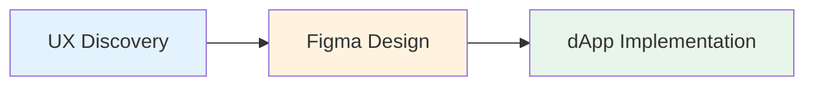

# Process Overview

Our development process ensures that what's designed is what gets built. Work flows through three distinct stages with clear deliverables and responsibilities at each step.

## Workflow Stages



Each stage builds on the previous one, ensuring alignment from concept to code.

---

## UX Discovery

The UX stage establishes the foundation for everything that follows. Clear requirements at this stage prevent costly changes later.

### Required Deliverables

#### Goal and Scope

**MUST** define:

* **Business objective** - What problem are we solving?
* **Target user** - Who is this for?
* **Success metrics** - How do we measure success?
* **Constraints** - Technical, timeline, or resource limitations

**Example**:
```
Goal: Enable users to browse and filter their land parcels efficiently
Target: Land owners with 10+ parcels
Success: 80% of users can find a specific parcel in under 10 seconds
Constraints: Must work on mobile; no backend changes allowed
```

#### Interaction Flows

**MUST** map end-to-end user journeys:

* **All use cases** - Primary and secondary user paths
* **Edge cases** - Empty states, first-time users, errors
* **Alternate paths** - Different ways to accomplish goals
* **Visual aids** - Wireframes or flow diagrams when helpful

**Example**:
```
Primary Flow:
1. User clicks "My Land"
2. System loads parcels
3. User applies filter
4. Results update immediately

Edge Cases:
- User has no parcels → Show empty state with CTA
- Filter returns no results → Show "no results" message
- Loading takes >2s → Show skeleton loaders
```

#### UI States

**SHOULD** specify all component states:

* **Idle** - Default state
* **Loading** - Data fetching or processing
* **Error** - Failed operations
* **Empty** - No data available
* **Success** - Successful operations
* **Disabled** - Unavailable actions

**SHOULD** outline error recovery:

* What happens when an error occurs?
* How can users retry or resolve it?
* What information do users need?

#### Analytics Tracking

**MUST** agree on tracking at this stage:

* **Events** - What actions to track
* **Properties** - What data to capture
* **User properties** - Relevant user attributes
* **Conversion goals** - Key success metrics

**Example**:
```
Events:
- parcel_filter_applied { filter_type, filter_value }
- parcel_selected { parcel_id, source }
- parcel_transfer_initiated { parcel_id }

Properties:
- user_parcel_count
- filter_used (boolean)
- time_to_result (ms)
```

### Recommended Deliverables

#### Accessibility Intent

**SHOULD** describe:

* **Keyboard flows** - Tab order and shortcuts
* **Focus order** - Logical focus progression
* **Screen reader labels** - ARIA labels and descriptions
* **Alternative content** - Text for images, icons, graphs

**Example**:
```
Keyboard Navigation:
- Tab: Navigate through filters
- Enter: Apply selected filter
- Escape: Close filter dropdown
- Arrow keys: Navigate filter options

Screen Reader:
- "Filter by: Owner address. Type to search or select from list"
- "3 parcels found matching your filters"
```

#### Accessibility Readability

**SHOULD** ensure:

* **Color contrast** - Minimum WCAG AA ratios
  * Normal text: 4.5:1
  * Large text (18pt+): 3:1
  * UI components: 3:1
* **Text sizing** - Readable at default sizes
* **Interactive targets** - Minimum 44×44px touch targets

#### UI Interactive Elements

**SHOULD** define states for all interactive elements:

* **Enabled** - Default interactive state
* **Disabled** - Non-interactive state
* **Hover** - Mouse over (desktop)
* **Pressed/Active** - During interaction
* **Focus** - Keyboard focus state

**SHOULD** specify user feedback:

* Visual changes on interaction
* Loading indicators
* Success/error messages
* Haptic feedback (mobile)

---

## Figma Design

Designers MUST start from our [Figma library](https://www.figma.com/design/tsyaDSedcsVZ8iM9N0McT2/DCL-UI2), which mirrors Material UI components and uses the Decentraland theme defined in UI2.


Special colors, sizes, or styles SHOULD NOT be used. Exceptions may exist but MUST be justified in the spec and approved during review.


### Required Standards

#### Use Decentraland Figma Library

**MUST** use MUI components when an equivalent exists:

* Check MUI component library first
* Use Decentraland variants and styles
* Don't create custom versions of existing components

**If a required UI element doesn't exist:**

1. Check if it can be composed from existing components
2. If not, propose a custom component (see [Custom Components](custom-components.md))
3. Document the rationale in the spec
4. Get approval during design review

#### Colors

**MUST** match Figma color styles to UI2 theme names:

```tsx
import { dclColors } from 'decentraland-ui2';

// Figma "Rarity / Unique" → Code
dclColors.rarity.unique

// Figma "Primary / Main" → Code
theme.palette.primary.main

// Figma "Text / Secondary" → Code
theme.palette.text.secondary
```

**Source of truth**: [colors.ts](https://github.com/decentraland/ui2/blob/master/src/theme/colors.ts)

#### Typography

**MUST** use defined variants:

Available variants:
* `h1`, `h2`, `h3`, `h4`, `h5`, `h6` - Headings
* `subtitle1`, `subtitle2` - Subheadings
* `body1`, `body2` - Body text
* `button` - Button text
* `caption` - Captions
* `overline` - Overline text

**References**:
* [Typography source](https://github.com/decentraland/ui2/blob/master/src/theme/typography.ts)
* [MUI Typography](https://mui.com/material-ui/react-typography/)
* [Material Design Type System](https://m2.material.io/design/typography/the-type-system.html#type-scale)

**Example mapping**:
```
Figma "H1" → <Typography variant="h1">
Figma "Body 1" → <Typography variant="body1">
Figma "Caption" → <Typography variant="caption">
```

#### Breakpoints

**MUST** design for these breakpoints:

| Name | Width | Typical Device |
|------|-------|----------------|
| `xs` | 768px | Mobile |
| `sm` | 991px | Tablet |
| `md` | 1024px | Small Desktop |
| `lg` | 1280px | Desktop |
| `xl` | 1500px | Large Desktop |

**Source**: [index.ts](https://github.com/decentraland/ui2/blob/master/src/theme/index.ts)

**Best practices**:
* Design mobile-first (start at `xs`)
* Show key breakpoints in Figma frames
* Document responsive behavior
* Test at viewport edges (767px, 768px, etc.)

#### Border Radius and Palettes

**MUST** use theme-defined values:

* Don't introduce new border radius values
* Don't create new palette roles
* Exceptions require spec justification and approval

**Theme values**:
```tsx
theme.shape.borderRadius // Default radius
theme.palette.primary    // Primary colors
theme.palette.secondary  // Secondary colors
theme.palette.error      // Error colors
theme.palette.text       // Text colors
theme.palette.background // Background colors
theme.palette.divider    // Divider colors
```

#### Color Schemes

**If the screen supports multiple color schemes:**

**MUST** provide:
* Which scheme applies (see [colorSchemes.ts](https://github.com/decentraland/ui2/blob/master/src/theme/colorSchemes.ts))
* Light mode preview
* Dark mode preview
* Documentation on switching schemes in Storybook

**Example**:
```
Supported Schemes: Light, Dark
Default: System preference
Toggle: Settings menu → Appearance
Storybook: Use "Theme" control in toolbar
```

### Component Selection

**SHOULD** reuse prepared components:

1. **Check MUI first** - Does MUI have this component?
2. **Check UI2** - Is there a Decentraland variant?
3. **Compose if possible** - Can you combine existing components?
4. **Custom as last resort** - Follow [Custom Components](custom-components.md) process

---

## dApp Implementation

Developers implement designs using UI2 components and following our [Styling & Theming](styling-and-theming.md) standards.

### Implementation Checklist

- [ ]  Start with UI2 component if available
- [ ]  Use MUI component with Decentraland theme if no UI2 equivalent
- [ ]  Follow [Styling & Theming](styling-and-theming.md) standards
- [ ]  Implement all states from UX spec
- [ ]  Add analytics tracking as specified
- [ ]  Test at all breakpoints
- [ ]  Verify keyboard navigation
- [ ]  Check color contrast
- [ ]  Test with screen reader
- [ ]  Handle loading and error states
- [ ]  Add to Storybook if it's a reusable component

### Component Implementation Flow

```
1. Check UI2 for component
   ↓
2. Found? → Use it
   ↓
3. Not found? → Check MUI
   ↓
4. Found in MUI? → Use with Decentraland theme
   ↓
5. Need customization? → See Custom Components guide
   ↓
6. Implement following Styling standards
   ↓
7. Add to Storybook (if reusable)
```

### Quality Gates

Before marking implementation complete:

1. **Visual match** - Matches Figma pixel-perfect at key breakpoints
2. **Theme compliance** - All values from UI2 theme
3. **States implemented** - All UX-specified states work
4. **Accessibility** - Keyboard nav, focus states, ARIA labels
5. **Analytics** - Events fire as specified
6. **Responsive** - Works at all breakpoints
7. **Performance** - No unnecessary re-renders
8. **Tests** - Component tests pass
9. **Storybook** - Stories added (if reusable)
10. **Code review** - Approved by maintainers

---

## Handoff Best Practices

### From UX to Design

* Clear requirements document
* User flows with annotations
* State diagrams for complex interactions
* Analytics event specifications

### From Design to Development

* Figma file with dev mode enabled
* Component specifications
* Responsive behavior notes
* Color and typography token mapping
* Accessibility annotations
* Link to UX requirements

### During Implementation

* Regular check-ins between designer and developer
* Early feedback on technical constraints
* Iterative reviews at key milestones
* Final review before merging

---

## Next Steps

* Learn about [Custom Components](custom-components.md) for creating new components
* Review [Styling & Theming](styling-and-theming.md) for implementation details
* See [Migration Guide](migration.md) if working with UI1 components

