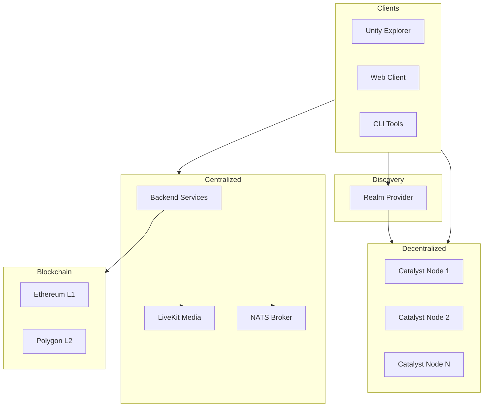

# Architecture Overview

Decentraland is a decentralized virtual world platform built on a hybrid architecture that combines blockchain ownership, decentralized content delivery, and centralized services for enhanced user experience.

## Architectural Principles

### Decentralization Where It Matters

* **Ownership** - Land, wearables, and names are NFTs on Ethereum
* **Governance** - DAO controls critical smart contracts and treasury
* **Content** - Distributed across Catalyst nodes
* **Identity** - Wallet-based authentication (no passwords)

### Centralization for Performance

* **Real-time services** - WebSocket communications, voice chat
* **Discovery** - Search, events, featured content
* **Social features** - Friends, communities, notifications
* **Optimization** - Asset processing, image generation

## System Layers

### Layer 1: Clients

Players interact through various clients:

* **Unity Explorer** - Primary desktop client (Windows, Mac, Linux)
* **Web Explorer** - Browser-based client
* **CLI** - Developer tooling for scene creation and deployment
* **Community Clients** - Alternative implementations for the reference client using different rendering technologies. 

All clients authenticate via crypto wallets and follow the same protocols.

### Layer 2: Discovery (Realm Provider)

Single entry point that provides clients with:

* Available Catalyst nodes (location, capacity, health)
* Backend service endpoints
* Hot scenes and active user counts

Enables intelligent realm selection based on geography and load.

### Layer 3: Decentralized Content (Catalyst Network)

Permissionless network of Catalyst nodes that store and serve:

* Scene definitions and assets
* Avatar profiles and wearables

Each node independently validates and stores content. Nodes synchronize deployments but operate autonomously. See [Catalyst Network](catalyst.md) for details.

### Layer 4: Centralized Services

Backend microservices provide enhanced functionality:

* **Service discovery** - Realm selection and health monitoring
* **Communications** - WebSocket clustering, voice/video access control
* **Content features** - Worlds, events, places, atlas data
* **Social features** - Friends, communities, notifications
* **Platform features** - Achievements, rewards, virtual credits
* **Asset processing** - Optimization, thumbnails, translations

See [Backend Services](services.md) for comprehensive service documentation.

### Layer 5: Infrastructure

Supporting systems and third-party services:

* **Message Broker** - NATS for inter-service communication
* **Media Server** - LiveKit for voice and video
* **Blockchain Indexers** - Fast queries for NFT data
* **Email Service** - SendGrid for notifications

See [Infrastructure](infrastructure.md) for details.

### Layer 6: Blockchain

Smart contracts on Ethereum and Polygon manage:

* **Ownership** - LAND, wearables, names, estates
* **Marketplace** - Trading and royalties
* **DAO** - Governance and treasury
* **Currency** - MANA token

## Data Flow Patterns

### Content Publishing

1. Creator deploys scene via CLI
2. CLI uploads to any Catalyst node
3. Catalyst validates and stores content
4. Other Catalyst nodes synchronize
5. Backend services process for optimization

### Player Session

1. Client queries Realm Provider for available realms
2. Selects optimal Catalyst node (geography + load)
3. Connects to Catalyst for content
4. Connects to Archipelago for communications
5. Backend services provide social/feature data

### Real-time Communications

1. Players report position to Archipelago
2. Archipelago assigns players to "islands" based on proximity
3. Messages routed only to nearby players
4. Voice chat via LiveKit with Gatekeeper tokens

## Security Model

### Identity & Authentication

* **Wallet signatures** - No passwords, authentication via Ethereum signatures
* **Auth Server** - Issues JWT tokens after signature verification
* **Signed Fetch** - APIs authenticate requests using wallet signatures

### Content Validation

* **Signature verification** - All deployments signed by wallet
* **Pointer ownership** - Only LAND owner can deploy to coordinates
* **Size limits** - Content size restricted by parcel count

### Access Control

* **Time-limited tokens** - JWT and LiveKit tokens expire
* **Rate limiting** - API rate limits per IP/user
* **DDoS protection** - Distributed Catalyst network

## Scalability Approach

### Horizontal Scaling

* **Catalyst nodes** - Add nodes as content grows
* **Backend services** - Stateless microservices scale independently
* **Islands** - Communications split into proximity-based groups

### Optimization

* **Asset bundles** - Platform-optimized assets (Unity bundles)
* **CDN** - Static assets served via CDN
* **Caching** - Aggressive caching at all layers
* **Indexers** - Blockchain data cached in fast databases

## Technology Stack

### Clients

* Unity (C#) - Explorer clients
* React + TypeScript - Web UIs
* Node.js + TypeScript - CLI tools

### Backend Services

* Node.js + TypeScript - Most services
* PostgreSQL - Primary database
* Redis - Caching layer

### Infrastructure

* Kubernetes - Container orchestration
* NATS - Message broker
* LiveKit (Go) - Media server

## Next Steps

Dive deeper into specific architectural areas:

* **[Backend Services](services.md)** - Detailed service specifications and integrations
* **[Catalyst Network](catalyst.md)** - Content delivery and deployment
* **[Infrastructure](infrastructure.md)** - Supporting systems and third-party services

## Additional Resources

* [API Reference](../../apis/README.md) - Complete API documentation
* [Contributor Guides](../contributor-guides/contributor-guides.md) - Development standards
* [GitHub Organization](https://github.com/decentraland) - Source code repositories
