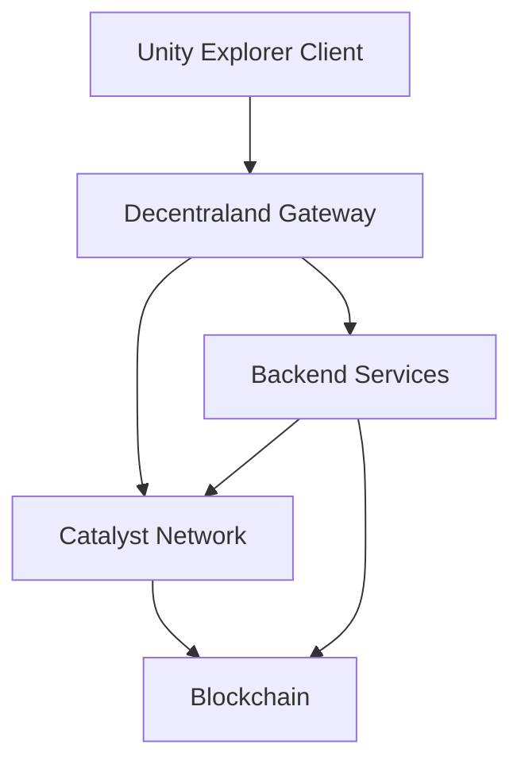
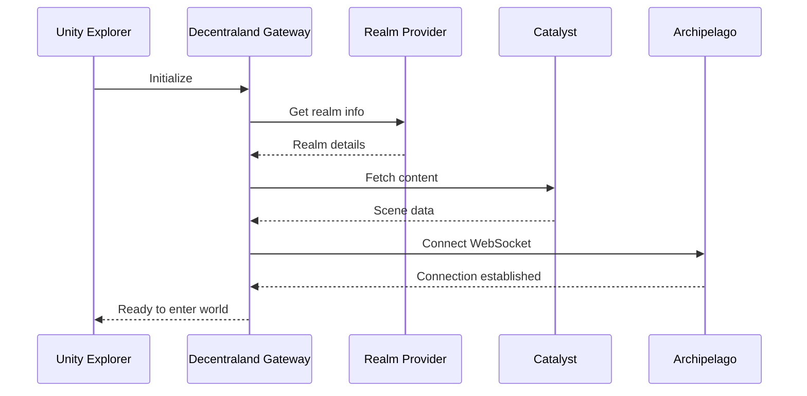
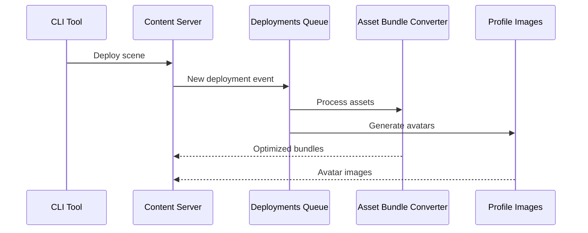

# Architecture Overview

This section provides a comprehensive overview of Decentraland's technical architecture, including the Reference Client (Unity Explorer) and all backend services that power the metaverse.

## General Architecture

The general architecture of Decentraland can be divided into three main components:

* **The Catalyst network**: distributed peer servers that host content and provide the core APIs.
* **The World Explorer**: app for players to log into Decentraland and explore the land.
* **The CLI**: a command-line interface for creators to develop and deploy content.

Decentraland is built on a distributed architecture that combines:

* **Decentralized Clients** - Unity Explorer and other clients
* **Catalyst Network** - Decentralized content servers
* **Backend Services** - Centralized services for enhanced functionality
* **Blockchain** - Ethereum and Polygon for ownership and transactions
* **Third-party Services** - LiveKit, SendGrid, and other SaaS providers


**Note**: The interactive architecture diagram from the original documentation has been preserved, but may require adaptation for Gitbook. You can view the [Foundation's architectural diagram](https://github.com/decentraland/documentation/blob/main/static/images/contributor/architecture.png) for reference.


## High-Level Architecture

## Documentation Sections

### [Client Architecture](client.md)

The Unity Explorer client and how it interacts with Decentraland services:

* Core client logic
* Decentraland Gateway integration
* Asset loading and caching
* Real-time communications

### [Backend Services](services.md)

Comprehensive overview of all backend services:

* **Core Services** - Authentication, realms, communications
* **Content Services** - Worlds, events, places, atlas
* **Social Services** - Friends, communities, notifications
* **Asset Services** - Asset bundles, camera reel, profile images
* **Platform Services** - Credits, badges, rewards, exploration games

### [Catalyst Network](catalyst.md)

The decentralized content delivery network:

* Content servers
* Lambdas (serverless functions)
* Archipelago workers (communications)
* Deployment pipeline

### [Infrastructure](infrastructure.md)

Supporting infrastructure and external services:

* Blockchain indexers (Squids, Satsuma, The Graph)
* Message brokers (NATS)
* Media servers (LiveKit)
* Email service (SendGrid)
* Translation and image processing

## Component Categories

### Client Components

| Component      | Purpose                          | Links |
| -------------- | -------------------------------- | ----- |
| Unity Explorer | Core client implementation       | -     |
| CLI Tools      | Scene development and deployment | -     |

### Core Backend Services

| Service                                                | Purpose                                 | API Reference                       |
| ------------------------------------------------------ | --------------------------------------- | ----------------------------------- |
| [Realm Provider](services.md#realm-provider)           | Describes available realms and services | [API](../apis/realm-provider/)      |
| [Auth Server](services.md#auth-server)                 | Authentication service                  | [API](../apis/auth-server/)         |
| [Comms Gatekeeper](services.md#comms-gatekeeper)       | LiveKit access control                  | [API](../apis/comms-gatekeeper/)    |
| [Archipelago Workers](services.md#archipelago-workers) | Communications clustering               | [API](../apis/archipelago-workers/) |

### Content & Social Services

| Service                                      | Purpose                | API Reference                  |
| -------------------------------------------- | ---------------------- | ------------------------------ |
| [Worlds](services.md#worlds)                 | Isolated scene hosting | [API](../apis/worlds/)         |
| [Events](services.md#events)                 | Event management       | [API](../apis/events/)         |
| [Places](services.md#places)                 | Points of interest     | [API](../apis/places/)         |
| [Social Service](services.md#social-service) | Friends & communities  | [API](../apis/social-service/) |
| [Atlas Server](services.md#atlas-server)     | Map data               | [API](../apis/atlas-server/)   |

### Asset & Media Services

| Service                                            | Purpose                    | API Reference                         |
| -------------------------------------------------- | -------------------------- | ------------------------------------- |
| [Asset Bundle Registry](services.md#asset-bundles) | Optimized asset management | [API](../apis/asset-bundle-registry/) |
| [Camera Reel](services.md#camera-reel)             | Screenshot management      | [API](../apis/camera-reel/)           |

### Platform Services

| Service                                            | Purpose                   | API Reference                         |
| -------------------------------------------------- | ------------------------- | ------------------------------------- |
| [Credits Server](services.md#credits-server)       | Virtual credits system    | [API](../apis/credits-server/)        |
| [Badges](services.md#badges)                       | User achievement system   | [API](../apis/badges/)                |
| [Notifications](services.md#notifications)         | User notifications        | [API](../apis/notifications-workers/) |
| [Events Notifier](services.md#events-notifier)     | Event-based notifications | [API](../apis/events-notifier/)       |
| [Exploration Games](services.md#exploration-games) | Onboarding games          | [API](../apis/exploration-games/)     |

## System Interactions

### Client to Services Flow

### Content Deployment Flow

## Key Integration Points

### Blockchain Integration

Services that interact with blockchain:

* **Worlds** - NFT ownership verification
* **Credits Server** - Token transactions
* **Rewards API** - NFT rewards distribution
* **Atlas Server** - Land parcel data

All blockchain queries go through indexers (Squids, Satsuma, The Graph) for performance.

### Communications Flow

Real-time communications architecture:

1. **Client** connects via **Decentraland Gateway**
2. **Realm Provider** assigns optimal realm
3. **Archipelago Workers** manage peer clustering
4. **NATS** handles message routing
5. **LiveKit** provides voice/video (gated by **Comms Gatekeeper**)

### Content Delivery

Content flow from creation to client:

1. **CLI** compiles and uploads scenes
2. **Catalyst** stores content
3. **Deployments Queue** triggers processing
4. **Asset Bundle Converter** optimizes assets
5. **Client** fetches optimized content

## Architecture Principles

### Decentralization

* **Catalyst nodes** are independently operated
* **Content** is replicated across multiple nodes
* **No single point of failure** for core content

### Scalability

* **Horizontal scaling** of backend services
* **CDN-like** content distribution via Catalyst
* **Peer clustering** for efficient communications

### Performance

* **Asset bundles** for optimized loading
* **Blockchain indexers** for fast queries
* **Caching** at multiple levels
* **Edge deployment** for low latency

### Security

* **Authentication** via crypto wallet signatures
* **Authorization** through Auth Server
* **Rate limiting** on API endpoints
* **DDoS protection** via Catalyst network

## Next Steps

* Explore [Client Architecture](client.md) for client-side details
* Review [Backend Services](services.md) for service specifications
* Check [Catalyst Network](catalyst.md) for decentralized infrastructure
* See [Infrastructure](infrastructure.md) for supporting systems

## Additional Resources

* [Contributor Guides](../contributor-guides/contributor-guides.md) - Coding and documentation standards
* [API Reference](../../apis/) - Complete API documentation
* [GitHub Organization](https://github.com/decentraland) - Source code repositories
