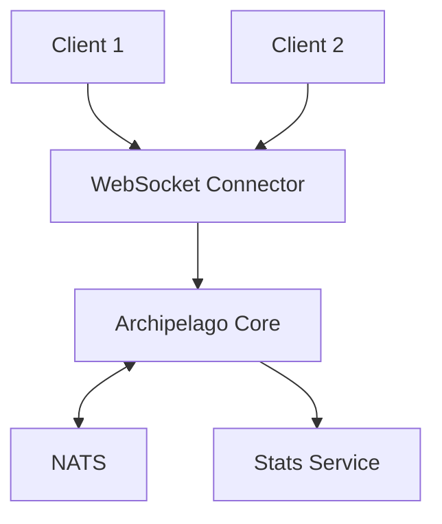
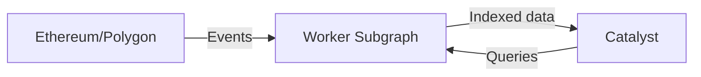

# Catalyst Network

The Catalyst network is Decentraland's decentralized content delivery infrastructure. Multiple independent operators run Catalyst nodes that store and serve content.

## Overview

The Catalyst network operates as a fully-meshed distributed system where nodes communicate directly with each other to synchronize content and maintain network health.

## Catalyst Components

Each Catalyst node consists of:

### Content Server

**Purpose**: Asset storage and retrieval

Stores and serves:

* Scene definitions
* 3D models and textures
* Audio files
* Scripts
* Avatars and wearables

**API Reference**: [Catalyst API](../apis/catalyst/)

### Lambdas

**Purpose**: Serverless query functions

Provides queryable endpoints:

* Entity searches
* Profile queries
* Content metadata
* Deployment history

Lambdas run as separate services that query the Content Server's database.

### Nginx

**Purpose**: Reverse proxy and load balancing

Routes requests to appropriate services:

* Content Server for uploads
* Lambdas for queries
* Static asset serving

***

## Content Deployment

### Deployment Flow

### Deployment Steps

1. **Compile**: CLI bundles scene using build-ecs
2. **Sign**: Creator signs deployment with wallet
3. **Upload**: CLI uploads to any Catalyst node
4. **Validate**: Catalyst validates signatures and content
5. **Store**: Content saved to storage
6. **Propagate**: Event published to deployment queue
7. **Process**: Backend services process new content

### Content Validation

Catalyst validates:

* Digital signatures (ownership proof)
* Content hashes (integrity)
* Parcel permissions (land ownership)
* File size limits
* Content policy compliance

***

## Deployments Pipeline

When content is deployed, multiple systems react:

### Asset Processing

**Triggered Services**:

* **Asset Bundle Converter** - Creates optimized bundles
* **Profile Images Producer** - Generates avatar thumbnails
* **Badges Processor** - Checks deployment achievements

### Listening Services

Services that monitor deployments:

* **Worlds** - For world deployments
* **Comms Gatekeeper** - For world voice config
* **Atlas Server** - For map updates

***

## Content Replication

Catalyst nodes replicate content to ensure availability:

### Replication Strategy

* **Active Syncing**: Nodes actively sync new deployments
* **Pull-based**: Nodes fetch missing content on-demand
* **Gossip Protocol**: Deployment announcements propagate

### Content Addressing

All content is content-addressed:

* Files identified by IPFS CID (Content Identifier)
* Immutable once deployed
* Deduplication automatic

***

## Archipelago Workers (Comms)

Communications infrastructure runs alongside Catalyst:

### Architecture

### Components

#### WebSocket Connector

* Maintains client connections
* Protocol handling
* Connection authentication

**API Reference**: [Archipelago Workers API](../apis/archipelago-workers/)

#### Archipelago Core

* **Island formation** - Groups nearby players
* **Peer limits** - Enforces max peers per island (typically 100)
* **Position updates** - Broadcasts player positions
* **Message routing** - Routes chat and emotes

#### Stats Service

* Active user counts per scene
* Connection statistics
* Performance metrics

***

## Blockchain Integration

### Subgraph Indexer

Catalyst uses a dedicated indexer:

The **Worker Subgraph** indexes:

* Land ownership (LAND NFTs)
* Wearable collections
* Name registrations
* Marketplace activity

***

## Infrastructure Components

### Monitoring

**cAdvisor**: Container resource monitoring

* CPU and memory usage
* Network I/O
* Storage metrics

### Message Broker

**NATS**: Pub/sub messaging

* Real-time position updates
* Friend status changes
* World events

**Used by**:

* Archipelago Workers
* Social Service
* Worlds

***

## Deployment Models

### Full Node

Complete Catalyst deployment:

* Content Server
* Lambdas
* Archipelago Workers
* All dependencies (NATS, databases)

### Content-Only

Lightweight deployment:

* Content Server only
* Relies on other nodes for comms
* Lower resource requirements

***

## Next Steps

* Review [Backend Services](services.md) for service details
* See [Infrastructure](infrastructure.md) for supporting systems
* Check [Architecture Overview](architecture.md) for the complete picture
