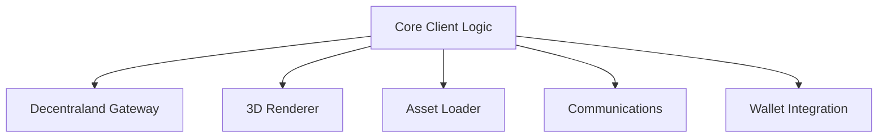
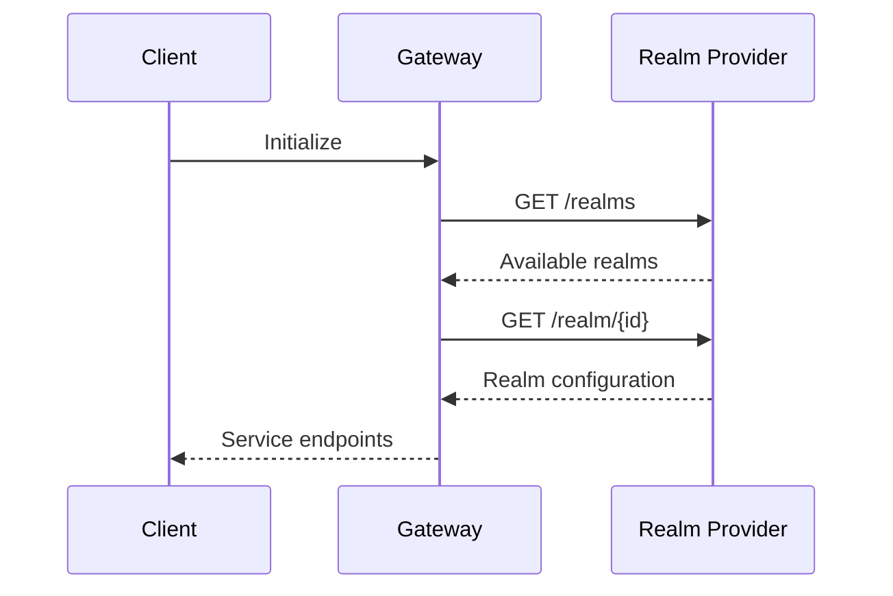
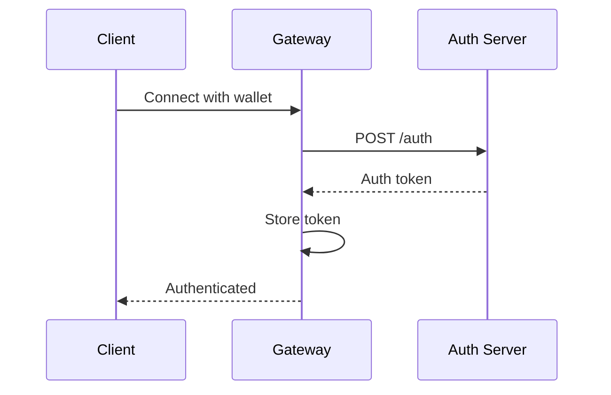
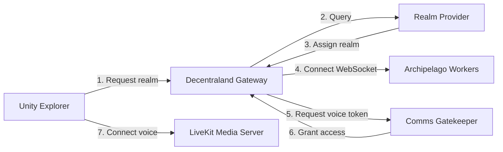
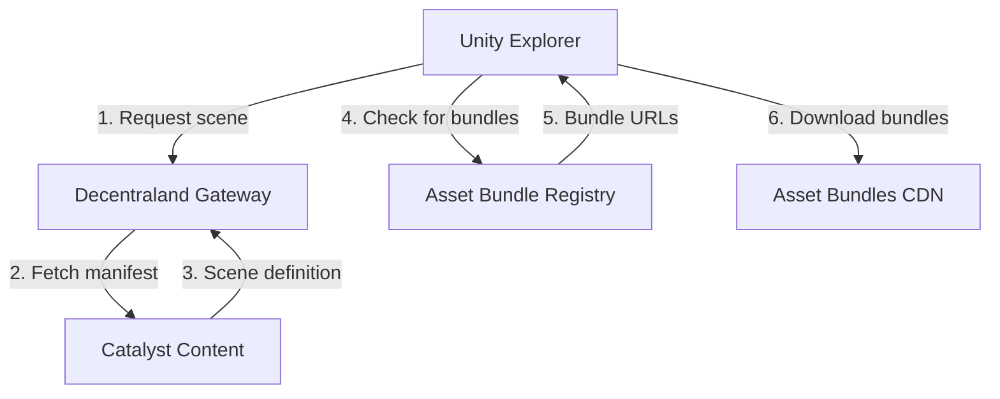
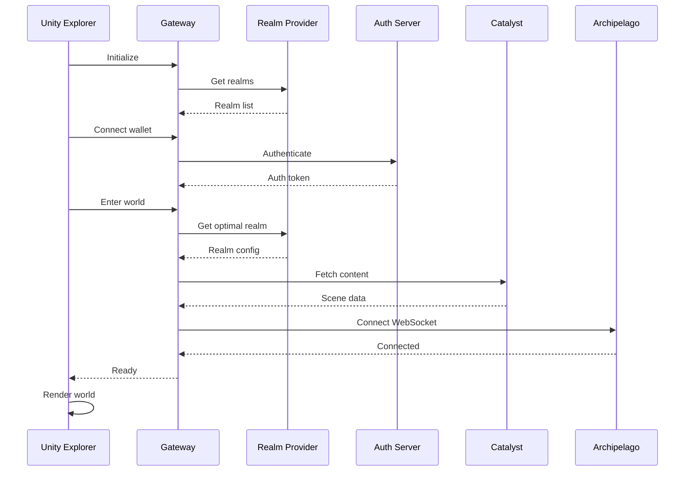
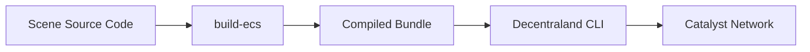
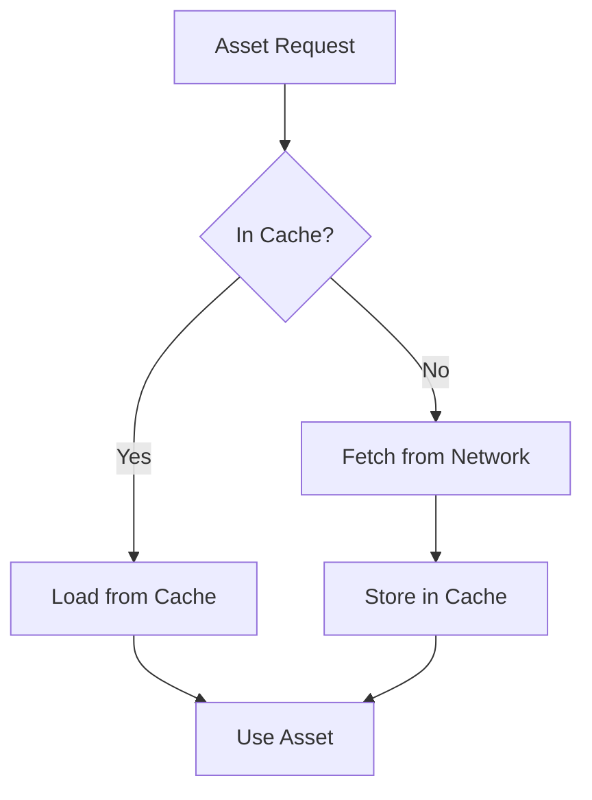

# Client Architecture

This page describes the Unity Explorer client and how it interacts with Decentraland's backend services.

## Unity Explorer

The Unity Explorer is Decentraland's reference client implementation built with Unity. It provides the complete metaverse experience including:

* 3D world rendering
* Avatar system
* Scene interaction
* Real-time communications
* Asset loading and caching
* Blockchain integration

### Core Components



***

## Decentraland Gateway

The Gateway is the client's primary interface to all backend services. It handles:

* Service discovery via [Realm Provider](../apis/realm-provider/)
* Authentication via [Auth Server](../apis/auth-server/)
* Content fetching from Catalyst
* WebSocket connections for communications
* API calls to various backend services

### Gateway Responsibilities

#### Service Discovery



The Gateway queries the **Realm Provider** to discover:

* Catalyst content servers
* Communication servers
* Available services and their endpoints

**API Reference**: [Realm Provider API](../apis/realm-provider/)

#### Authentication



The Gateway handles authentication through the **Auth Server**:

* Wallet signature verification
* Token generation and refresh
* Session management

**API Reference**: [Auth Server API](../apis/auth-server/)

***

## Service Connections

The client connects to multiple services through the Gateway:

### Core Services

| Service                 | Purpose            | When Used            | API Reference                       |
| ----------------------- | ------------------ | -------------------- | ----------------------------------- |
| **Realm Provider**      | Service discovery  | On startup           | [API](../apis/realm-provider/)      |
| **Auth Server**         | Authentication     | On wallet connection | [API](../apis/auth-server/)         |
| **Catalyst**            | Content delivery   | Continuous           | [API](../apis/catalyst/)            |
| **Archipelago Workers** | Communications     | When in-world        | [API](../apis/archipelago-workers/) |
| **Comms Gatekeeper**    | Voice/video access | When using voice     | [API](../apis/comms-gatekeeper/)    |

### Content & Social Services

| Service            | Purpose              | When Used        | API Reference                  |
| ------------------ | -------------------- | ---------------- | ------------------------------ |
| **Places**         | POIs and hot scenes  | Map/explore UI   | [API](../apis/places/)         |
| **Events**         | Event information    | Events UI        | [API](../apis/events/)         |
| **Worlds**         | Private world access | World navigation | [API](../apis/worlds/)         |
| **Social Service** | Friends list         | Social features  | [API](../apis/social-service/) |
| **Atlas Server**   | Map data             | Map UI           | [API](../apis/atlas-server/)   |

### Asset & Media Services

| Service                   | Purpose          | When Used     | API Reference                         |
| ------------------------- | ---------------- | ------------- | ------------------------------------- |
| **Asset Bundle Registry** | Optimized assets | Asset loading | [API](../apis/asset-bundle-registry/) |
| **Camera Reel**           | Screenshots      | Photo feature | [API](../apis/camera-reel/)           |

### Platform Services

| Service               | Purpose             | When Used             | API Reference                         |
| --------------------- | ------------------- | --------------------- | ------------------------------------- |
| **Credits Server**    | Virtual currency    | Purchases             | [API](../apis/credits-server/)        |
| **Badges**            | Achievements        | Profile/badges UI     | [API](../apis/badges/)                |
| **Notifications**     | User notifications  | Notifications UI      | [API](../apis/notifications-workers/) |
| **Events Notifier**   | Event notifications | Event participation   | [API](../apis/events-notifier/)       |
| **Exploration Games** | Onboarding          | First-time experience | [API](../apis/exploration-games/)     |

***

## Communications Architecture

Real-time communications flow through multiple services:



### Communication Steps

1. **Realm Assignment**: Client queries [Realm Provider](../apis/realm-provider/) for optimal realm
2. **WebSocket Connection**: Connects to [Archipelago Workers](../apis/archipelago-workers/) for text chat and positions
3. **Voice Access**: Requests token from [Comms Gatekeeper](../apis/comms-gatekeeper/)
4. **Media Connection**: Connects to LiveKit for voice/video

***

## Asset Loading Pipeline

The client uses optimized assets for better performance:



### Asset Loading Steps

1. **Scene Discovery**: Fetch scene definition from Catalyst
2. **Bundle Check**: Query [Asset Bundle Registry](../apis/asset-bundle-registry/) for optimized versions
3. **Download**: Load optimized asset bundles instead of raw assets
4. **Fallback**: Use original assets if bundles unavailable

***

## Client Initialization Flow

Complete startup sequence:



***

## CLI Tools

The Decentraland CLI enables scene development and deployment:

### CLI Features

* **Project scaffolding** - Create new scene projects
* **Local preview** - Test scenes in browser
* **Scene compilation** - Bundle scenes with build-ecs
* **Deployment** - Upload to Catalyst network

### Build Pipeline



The **build-ecs** tool:

* Bundles scene code (AMD and ECS)
* Optimizes for deployment
* Generates deployable scene packages

***

## Client-Side Caching

The client implements multiple caching layers:

### Cache Types

| Cache             | Purpose             | Invalidation         |
| ----------------- | ------------------- | -------------------- |
| **Scene Cache**   | Compiled scenes     | Version changes      |
| **Asset Cache**   | 3D models, textures | Content hash changes |
| **Bundle Cache**  | Asset bundles       | Registry updates     |
| **Profile Cache** | User profiles       | Time-based (5 min)   |
| **Realm Cache**   | Realm list          | Time-based (1 min)   |

### Cache Strategy



***

## Performance Optimizations

### Asset Bundle Benefits

* **Reduced load times** - Pre-compiled, platform-optimized assets
* **Smaller downloads** - Compressed bundles
* **LODs** - Level of detail support for distant objects

### Connection Pooling

* **Persistent connections** to frequently used services
* **Connection reuse** for multiple API calls
* **WebSocket** for real-time updates instead of polling

### Lazy Loading

* **On-demand** scene loading as user moves
* **Progressive** asset loading (critical first, then details)
* **Background** prefetching of nearby areas

***

## Error Handling

The client implements robust error handling:

### Retry Strategy

```typescript
// Pseudocode
async function fetchWithRetry(url, maxRetries = 3) {
  for (let attempt = 1; attempt <= maxRetries; attempt++) {
    try {
      return await fetch(url);
    } catch (error) {
      if (attempt === maxRetries) throw error;
      await wait(exponentialBackoff(attempt));
    }
  }
}
```

### Fallback Mechanisms

* **Alternative Catalyst** - Switch to different content server
* **Default Assets** - Use placeholder assets if load fails
* **Offline Mode** - Limited functionality without connection
* **Service Degradation** - Continue with reduced features

***

## Next Steps

* Explore [Backend Services](services.md) for service details
* Review [Catalyst Network](catalyst.md) for content delivery
* See [Infrastructure](infrastructure.md) for supporting systems
* Check [Architecture Overview](architecture.md) for the big picture
