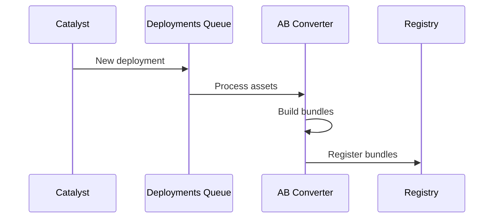
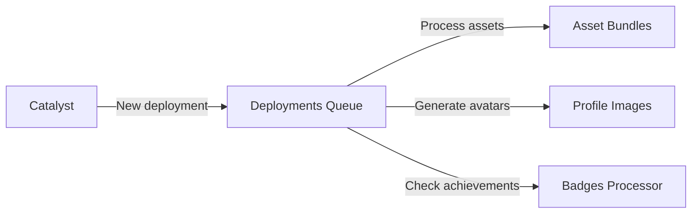

# Backend Services

This page provides a comprehensive overview of all Decentraland backend services, their purposes, and how they interact.

## Service Categories

Services are organized into logical categories based on their primary functions:

* **Core Services** - Essential infrastructure
* **Content Services** - Scene and content management
* **Social Services** - Community and interactions
* **Asset Services** - Media and asset processing
* **Platform Services** - Features and rewards

***

## Core Services

### Realm Provider

**Purpose**: Describes available realms and their services

The Realm Provider is the service discovery endpoint. Clients query it to find:

* Available Catalyst servers
* Communication servers
* Service health and capacity

**API Reference**: [Realm Provider API](../apis/realm-provider/)

**Key Endpoints**:

* `GET /realms` - List all available realms
* `GET /realm/{id}` - Get specific realm configuration

### Auth Server

**Purpose**: Authentication and authorization service

Handles wallet-based authentication:

* Signature verification
* Token generation and validation
* Session management

**API Reference**: [Auth Server API](../apis/auth-server/)

### Comms Gatekeeper

**Purpose**: LiveKit access control

Gates access to LiveKit media server:

* Generates time-limited tokens
* Enforces world-based permissions
* Monitors connection limits

**API Reference**: [Comms Gatekeeper API](../apis/comms-gatekeeper/)

### Archipelago Workers

**Purpose**: Communications clustering and message routing

Manages peer-to-peer clustering:

* WebSocket connections
* Island/cluster formation
* Message routing via NATS
* Connection statistics

**API Reference**: [Archipelago Workers API](../apis/archipelago-workers/)

**Components**:

* **WebSocket Connector** - Handles client connections
* **Archipelago Core** - Clustering logic
* **Stats Service** - Connection analytics

***

## Content Services

### Worlds

**Purpose**: Isolated scene hosting

Manages private and named worlds:

* World deployment
* Access control
* Scene configuration
* LiveKit integration for world voice

**API Reference**: [Worlds API](../apis/worlds/)

**Interactions**:

* Queries blockchain for NFT ownership
* Publishes to NATS for real-time updates
* Triggers deployment processing

### Events

**Purpose**: Decentraland events management

Manages virtual events:

* Event creation and updates
* Attendee tracking
* Event discovery

**API Reference**: [Events API](../apis/events/)

### Places

**Purpose**: Points of interest discovery

Provides curated locations:

* Hot scenes (by user count)
* Featured locations
* Search and filtering

**API Reference**: [Places API](../apis/places/)

**Dependencies**:

* Catalyst - Scene metadata
* Archipelago Stats - User counts
* Comms Gatekeeper - Realm status

### Atlas Server

**Purpose**: Map data and parcel information

Provides map tiles and land data:

* Parcel ownership
* Scene names and coordinates
* Map tiles for UI

**API Reference**: [Atlas Server API](../apis/atlas-server/)

***

## Social Services

### Social Service

**Purpose**: Friends and communities management

Handles social relationships:

* Friend requests and lists
* Blocked users
* Communities
* Real-time friend status via NATS

**API Reference**: [Social Service API](../apis/social-service/)

**Dependencies**:

* Catalyst Client - Profile data
* NATS - Real-time updates
* Archipelago - Online status

***

## Asset Services

### Asset Bundle Registry

**Purpose**: Optimized asset management

Registry of platform-optimized asset bundles:

* Asset bundle URLs by platform
* Versioning
* CDN distribution

**API Reference**: [Asset Bundle Registry API](../apis/asset-bundle-registry/)

**System Components**:

* **Asset Bundle Converter** - Builds platform-specific bundles
* **LODs Generator** - Creates level-of-detail variants

**Process Flow**:

### Camera Reel

**Purpose**: Screenshot and image management

User-generated content management:

* Screenshot storage
* Image uploads
* Gallery organization

**API Reference**: [Camera Reel API](../apis/camera-reel/)

***

## Platform Services

### Credits Server

**Purpose**: Virtual currency system

Manages Decentraland credits:

* Balance tracking
* Transactions
* Purchase history

**API Reference**: [Credits Server API](../apis/credits-server/)

**Blockchain Integration**: Queries indexers for on-chain credit balances

### Badges

**Purpose**: User achievement system

Manages user badges and achievements:

* Badge definitions
* User badge inventory
* Badge granting logic

**API Reference**: [Badges API](../apis/badges/)

**System Components**:

* **Badges API** - Badge queries
* **Badges Processor** - Grants badges based on events

### Notifications

**Purpose**: User notification inbox

Manages in-app notifications:

* Notification delivery
* Read/unread status
* Notification history

**API Reference**: [Notifications API](../apis/notifications-workers/)

**System Components**:

* **Notifications Inbox** - User notification queries
* **Notifications Processor** - Generates notifications from events

**External Integration**: SendGrid for email notifications

### Events Notifier

**Purpose**: Event-driven notification triggers

Publishes events that trigger notifications and badges:

* User events (login, purchase, etc.)
* World events (deployment, etc.)
* System events

**API Reference**: [Events Notifier API](../apis/events-notifier/)

**Triggers**:

* Notification creation via Notifications Processor
* Badge grants via Badges Processor

### Exploration Games

**Purpose**: Onboarding mini-games

Gamification for new users:

* Quest tracking
* Progress management
* Reward integration

**API Reference**: [Exploration Games API](../apis/exploration-games/)

***

## Service Interactions

### Common Patterns

#### Catalyst Client

Many services use the **Catalyst Client** library to interact with Catalyst servers:

* Social Service - Profile data
* Events - Scene metadata
* Places - Scene information
* Asset Bundle Registry - Scene deployments

#### NATS Message Broker

Real-time updates flow through NATS:

* Social Service - Friend status
* Worlds - World updates
* Archipelago - Position updates

#### Blockchain Indexers

Services query indexers (not blockchain directly):

* Worlds - NFT ownership
* Atlas - Land parcels
* Credits Server - Token balances
* Rewards API - NFT verification

### Deployment Pipeline

When content is deployed to Catalyst:

1. **Deployments Queue** receives event
2. **Asset Bundle Converter** optimizes assets
3. **Profile Images** generates avatar thumbnails
4. **Badges Processor** checks for deployment badges

***

## Service Dependencies Matrix

| Service               | Depends On                        | Provides To                    |
| --------------------- | --------------------------------- | ------------------------------ |
| Realm Provider        | Catalyst, Archipelago             | All clients                    |
| Auth Server           | -                                 | All services                   |
| Archipelago           | NATS, LiveKit                     | Realm Provider, Places         |
| Worlds                | Catalyst, LiveKit, NATS           | Gatekeeper, Clients            |
| Social Service        | Catalyst, NATS, Archipelago       | Clients                        |
| Places                | Catalyst, Archipelago, Gatekeeper | Clients                        |
| Events Notifier       | -                                 | Notifications, Badges, Rewards |
| Asset Bundle Registry | Catalyst                          | Clients                        |

***

## Next Steps

* Explore [Client Architecture](client.md) for client-side integration
* Review [Catalyst Network](catalyst.md) for content infrastructure
* See [Infrastructure](infrastructure.md) for supporting systems
* Check [Architecture Overview](architecture.md) for the complete picture
