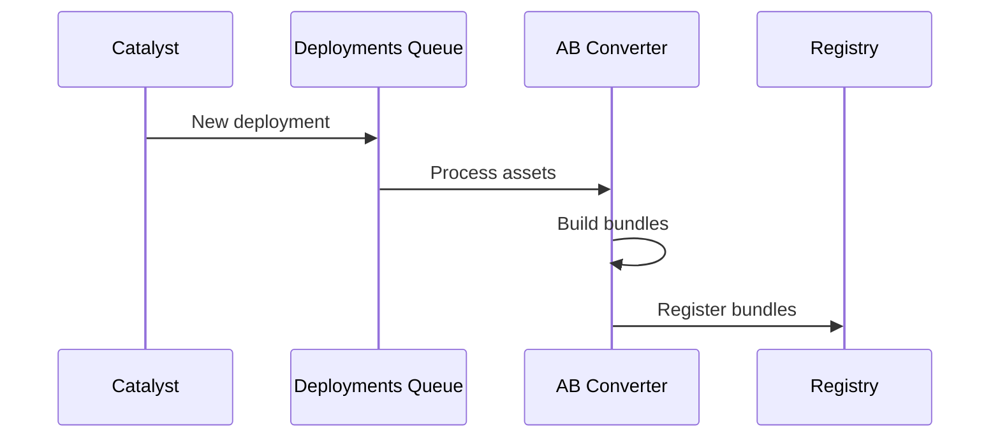
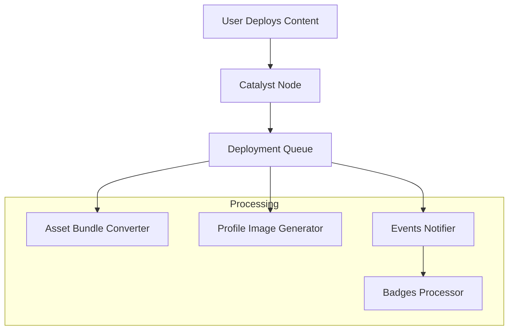

# Backend Services

This page provides a comprehensive overview of all Decentraland backend services, their architectural roles, and how they interact within the ecosystem. For detailed API specifications and endpoints, refer to the [API Reference](../../apis/README.md) section.

## Service Architecture

Decentraland's backend is composed of distributed microservices organized into logical layers:

* **Decentralized Layer** - Catalyst network and content delivery infrastructure
* **Real-Time Communications Layer** - Service discovery and peer-to-peer communications
* **Feature Services** - User-facing functionality (content, economy, gamification)
* **Core Services** - Essential platform infrastructure (auth, marketplace, notifications)

***

## Decentralized Layer

### Catalyst

**Purpose**: Decentralized content delivery network

The Catalyst network forms the foundation of Decentraland's content infrastructure. Each Catalyst node is a complete server that provides:

* **Content Server** - Entity storage and retrieval (scenes, profiles, wearables)
* **Lambdas Service** - Utility endpoints and content queries
* **Communications Server** - Real-time message transport

**Architecture Role**: Catalyst nodes are geographically distributed and permissionless. The network provides content redundancy and availability without central control.

**Key Integrations**:
* Realm Provider - Advertises node availability
* Asset Bundle Registry - Triggers asset optimization on deployment
* Archipelago Workers - Provides island/cluster data

**API Reference**: [Catalyst API](../../apis/catalyst/overview)

### Lamb2

**Purpose**: Lambda utilities and serverless functions

Lamb2 provides utility endpoints for content consumption and queries that complement the Content Server:

* Scene aggregation and filtering
* Profile queries with fallbacks
* Status and health checks

**Architecture Role**: Acts as a convenience layer over the Content Server's raw entity access, providing higher-level query patterns commonly needed by clients.

**API Reference**: [Lamb2 API](../../apis/lamb2/overview)

***

## Real-Time Communications Layer

### Realm Provider

**Purpose**: Service discovery and realm selection

The Realm Provider is the entry point for all Decentraland clients. It implements intelligent realm selection based on:

* **Geographic optimization** - Routes users to nearest Catalyst nodes
* **Health monitoring** - Filters unhealthy or overloaded nodes
* **Capacity tracking** - Provides real-time user counts per realm
* **Hot scenes aggregation** - Identifies popular locations across all realms

**Architecture Role**: Single source of truth for available infrastructure. Clients query it once on startup to discover all service endpoints (Catalyst, Comms, BFF).

**Key Integrations**:
* Polls all Catalyst nodes periodically
* Aggregates Archipelago statistics
* Provides unified view of distributed network

**API Reference**: [Realm Provider API](../../apis/realm-provider/overview)

### Comms Gatekeeper

**Purpose**: Voice and video access control

The Gatekeeper manages access to LiveKit media servers for voice and video chat:

* **Token generation** - Creates time-limited access tokens with specific permissions
* **Scene administration** - Manages scene admin rights and banning
* **Stream management** - Controls live streaming access and RTMP keys
* **Privacy controls** - Enforces private voice chat permissions

**Architecture Role**: Security layer between clients and media infrastructure. Prevents unauthorized access while enabling flexible permission models (scene-based, private, community).

**Key Integrations**:
* LiveKit - Issues JWT tokens for media server access
* Worlds API - Validates world ownership for admin rights
* Signed Fetch - Authenticates all requests via wallet signatures

**API Reference**: [Comms Gatekeeper API](../../apis/comms-gatekeeper/overview)

### Archipelago Workers

**Purpose**: Communications clustering and message routing

Archipelago implements the proximity-based clustering protocol that groups nearby players into "islands":

* **WebSocket transport** - Maintains persistent connections with clients
* **Position tracking** - Monitors player locations in real-time
* **Island formation** - Dynamically groups players based on distance
* **Message routing** - Forwards messages only to island members

**Architecture Components**:
* **WebSocket Connector** - Handles client connections and authentication
* **Archipelago Core** - Implements clustering algorithm and island management
* **Stats Service** - Provides connection metrics and user counts
* **NATS Integration** - Publishes position updates and routes messages

**Architecture Role**: Optimizes peer-to-peer communications by limiting message fanout. Instead of broadcasting to all users in a realm, messages only reach players within interaction range.

**Key Integrations**:
* NATS message broker - Distributed message routing
* Realm Provider - Provides island statistics
* Places API - User count data for hot scenes

**API Reference**: [Archipelago Workers API](../../apis/archipelago-workers/overview)

***

## Feature Services

### Worlds

**Purpose**: Isolated scene hosting outside the main grid

Worlds enable users to deploy scenes in isolated environments:

* **Named Worlds** - Accessible via custom URLs (e.g., `world.dclworlds.com`)
* **Private Worlds** - NFT-gated access control
* **World Permissions** - Owner-managed admin and deployment rights

**Architecture Role**: Extends Decentraland's content model beyond the fixed LAND grid. Each world is a standalone scene with its own communication channels and access control.

**Key Integrations**:
* Queries blockchain indexers for NFT ownership verification
* Publishes world updates to NATS for real-time client synchronization
* Integrates with Comms Gatekeeper for voice chat rooms
* Triggers asset processing pipeline on deployment

**API Reference**: [Worlds API](../../apis/worlds/overview)

### Events

**Purpose**: In-world event management and discovery

Manages the full lifecycle of virtual events:

* **Event CRUD** - Creation, updates, and scheduling
* **Attendee tracking** - User participation and RSVPs
* **Discovery** - Time-based queries and filtering
* **Notifications** - Integration with Events Notifier

**Architecture Role**: Provides temporal context to the metaverse. Events drive user discovery and engagement by highlighting time-sensitive experiences.

**API Reference**: [Events API](../../apis/events/overview)

### Places

**Purpose**: Points of interest discovery and curation

Aggregates and curates interesting locations across Decentraland:

* **Hot scenes** - Real-time popularity based on user counts
* **Featured places** - Editorially curated locations
* **Search and filtering** - Discovery by tags, categories
* **POI metadata** - Descriptions, thumbnails, coordinates

**Architecture Role**: Solves the discovery problem in a large open world. Aggregates data from multiple sources to help users find engaging content.

**Key Integrations**:
* Catalyst - Scene metadata and deployment info
* Archipelago Stats - Real-time user counts per scene
* Comms Gatekeeper - Realm availability and status

**API Reference**: [Places API](../../apis/places/overview)

### Atlas Server

**Purpose**: Map data and parcel visualization

Provides comprehensive world map data:

* **Parcel ownership** - Blockchain-indexed LAND data
* **Scene metadata** - Deployed scene names and coordinates
* **Map tiles** - Pre-rendered tile images for UI display
* **Spatial queries** - Find parcels by coordinates or owner

**Architecture Role**: Provides the spatial index for Decentraland's LAND grid. Essential for map UIs and spatial navigation.

**API Reference**: [Atlas Server API](../../apis/atlas-server/overview)

### Camera Reel

**Purpose**: User-generated screenshot management

Manages user screenshots and images:

* **Image uploads** - Authenticated image storage
* **Gallery organization** - User screenshot collections
* **Metadata** - Scene location, timestamp, tags

**Architecture Role**: Enables content sharing and social features around user-generated photography.

**API Reference**: [Camera Reel API](../../apis/camera-reel/overview)

### Exploration Games

**Purpose**: Onboarding gamification and tutorials

Interactive quest system for new user onboarding:

* **Quest tracking** - Progress through tutorial missions
* **Challenge completion** - Task verification
* **Reward integration** - Connects to rewards system

**Architecture Role**: Reduces friction for new users by providing structured, goal-oriented introduction to Decentraland features.

**API Reference**: [Exploration Games API](../../apis/exploration-games/overview)

***

## Core Services

### Auth Server

**Purpose**: Wallet-based authentication and session management

Implements Decentraland's wallet-first authentication model:

* **Signature verification** - Validates Ethereum wallet signatures
* **JWT token issuance** - Generates session tokens
* **Token validation** - Verifies tokens for protected resources
* **Session lifecycle** - Token refresh and expiration

**Architecture Role**: Provides decentralized identity verification. Users authenticate via wallet signatures rather than passwords, aligning with Web3 principles.

**Authentication Flow**:
1. Client requests challenge
2. User signs challenge with wallet
3. Auth Server verifies signature and issues JWT
4. Client includes JWT in subsequent API requests

**API Reference**: [Auth Server API](../../apis/auth-server/overview)

### Social Service

**Purpose**: Social graph and community management

Manages social relationships and communities:

* **Friend system** - Requests, approvals, friend lists
* **Block list** - User blocking and privacy
* **Communities** - Group membership and discovery
* **Real-time status** - Friend online/offline notifications via NATS
* **Private messaging** - Direct message infrastructure

**Architecture Role**: Provides the social layer that transforms Decentraland from a virtual world into a social metaverse.

**Key Integrations**:
* Catalyst Client - Fetches profile data for friends
* NATS - Publishes friend status updates
* Archipelago - Queries online status and locations

**API Reference**: [Social Service API](../../apis/social-service/overview)

### Marketplace Server

**Purpose**: NFT marketplace integration

Backend for Decentraland's wearables and emotes marketplace:

* **Listing queries** - Browse and search marketplace items
* **Transaction history** - Purchase records
* **Pricing data** - Market prices and trends
* **Collection metadata** - Wearable and emote collections

**Architecture Role**: Bridges on-chain NFT data with user-friendly marketplace UI. Indexes blockchain events for fast queries.

**API Reference**: [Marketplace Server API](../../apis/marketplace-server/overview)

***

## Asset Services

### Asset Bundle Registry

**Purpose**: Optimized asset management

Registry of platform-optimized asset bundles:

* Asset bundle URLs by platform
* Versioning
* CDN distribution

**API Reference**: [Asset Bundle Registry API](../apis/asset-bundle-registry/)

**System Components**:

* **Asset Bundle Converter** - Builds platform-specific bundles
* **LODs Generator** - Creates level-of-detail variants

**Process Flow**:

### Camera Reel

**Purpose**: Screenshot and image management

User-generated content management:

* Screenshot storage
* Image uploads
* Gallery organization

**API Reference**: [Camera Reel API](../apis/camera-reel/)

### Credits Server

**Purpose**: Virtual currency and economy

Manages Decentraland's virtual credit system:

* **Balance tracking** - User credit balances
* **Transaction ledger** - Credit transfers and spending
* **Purchase integration** - Fiat-to-credits conversion
* **Blockchain sync** - Queries indexers for on-chain balances

**Architecture Role**: Provides a lower-friction currency alternative to blockchain tokens for in-world purchases and features.

**API Reference**: [Credits Server API](../../apis/credits-server/overview)

### Badges

**Purpose**: Achievement and gamification system

Event-driven badge awards:

* **Badge definitions** - Available achievements
* **User inventory** - Earned badges per user
* **Automatic granting** - Event-triggered badge awards

**Architecture Components**:
* **Badges API** - Badge queries and user inventories
* **Badges Processor** - Listens to Events Notifier and grants badges

**Architecture Role**: Gamifies user engagement through achievements. Provides visibility and recognition for user activities.

**API Reference**: [Badges API](../../apis/badges/overview)

### Rewards API

**Purpose**: Campaign-based NFT reward distribution

Manages promotional NFT reward campaigns:

* **Campaign management** - Time-limited reward programs
* **Eligibility verification** - Check user qualification
* **Airdrop coordination** - NFT distribution to eligible users
* **Analytics** - Campaign participation tracking

**Architecture Role**: Enables marketing campaigns and user acquisition through NFT rewards.

**API Reference**: [Rewards API](../../apis/rewards/overview)

### Notifications Workers

**Purpose**: User notification delivery system

Multi-channel notification infrastructure:

* **In-app notifications** - Notification inbox queries
* **Email notifications** - SendGrid integration
* **Push notifications** - Mobile and desktop alerts
* **Read status tracking** - Mark notifications as read/unread

**Architecture Components**:
* **Notifications Inbox** - API for querying user notifications
* **Notifications Processor** - Generates notifications from Events Notifier

**Architecture Role**: Keeps users engaged through timely alerts about friend activity, events, rewards, and system updates.

**API Reference**: [Notifications Workers API](../../apis/notifications-workers/overview)

### Events Notifier

**Purpose**: Event bus for platform events

Centralized event publishing system that triggers downstream actions:

* **User events** - Login, purchases, deployments
* **World events** - Scene updates, admin actions
* **System events** - Maintenance, updates

**Architecture Role**: Decouples event producers from consumers. Services publish events without knowing who processes them, enabling extensible architectures.

**Downstream Integrations**:
* Notifications Processor - Creates user notifications
* Badges Processor - Grants achievement badges
* Rewards API - Tracks campaign eligibility

**API Reference**: [Events Notifier API](../../apis/events-notifier/overview)

***

## Service Interaction Patterns

### Common Integration Patterns

#### Catalyst Client Library

Many backend services use the **Catalyst Client** library to interact with the decentralized Catalyst network:

* **Social Service** - Fetches user profile data
* **Events API** - Queries scene metadata
* **Places** - Aggregates scene information
* **Asset Bundle Registry** - Listens for deployment events

This library abstracts away multi-node querying and failover logic.

#### NATS Message Broker

Real-time updates and asynchronous communication flow through NATS:

* **Social Service** - Publishes friend status changes
* **Worlds** - Broadcasts world configuration updates
* **Archipelago** - Routes position updates between islands
* **Events Notifier** - Publishes platform events

NATS enables services to communicate without direct coupling.

#### Blockchain Indexers

Services query indexers (not blockchain directly) for performance:

* **Worlds** - Verifies NAME NFT ownership
* **Atlas** - Fetches LAND parcel data
* **Credits Server** - Checks token balances
* **Rewards API** - Verifies eligibility conditions

Direct blockchain queries would be too slow for real-time APIs.

### Content Deployment Pipeline

When a user deploys content to Catalyst, multiple downstream services process it:

**Pipeline Steps**:

1. **Catalyst** - Stores raw entity data
2. **Deployment Queue** - Triggers async processing
3. **Asset Bundle Converter** - Builds optimized Unity bundles
4. **Profile Image Generator** - Renders avatar thumbnails (for profile entities)
5. **Events Notifier** - Publishes deployment event
6. **Badges Processor** - Checks for deployment achievement badges

### Service Dependency Matrix

| Service               | Core Dependencies              | Provides Data To               |
| --------------------- | ------------------------------ | ------------------------------ |
| Catalyst              | None (decentralized)           | All services                   |
| Realm Provider        | Catalyst, Archipelago Stats    | All clients                    |
| Auth Server           | None                           | All protected services         |
| Archipelago Workers   | NATS, LiveKit                  | Realm Provider, Places         |
| Comms Gatekeeper      | LiveKit, Worlds API            | Clients (token generation)     |
| Worlds                | Catalyst, NATS, Blockchain     | Gatekeeper, Clients            |
| Social Service        | Catalyst, NATS, Archipelago    | Clients                        |
| Places                | Catalyst, Archipelago, Comms   | Clients                        |
| Events Notifier       | None                           | Notifications, Badges, Rewards |
| Asset Bundle Registry | Catalyst, Deployment Queue     | Clients (optimized assets)     |
| Notifications Workers | Events Notifier, SendGrid      | Clients                        |

***

## Related Documentation

### Architecture

* [Architecture Overview](architecture.md) - Complete system architecture
* [Catalyst Network](catalyst.md) - Decentralized content delivery
* [Infrastructure](infrastructure.md) - Supporting systems (NATS, LiveKit, databases)

### API References

* [API Documentation](../../apis/README.md) - Complete API specifications
* [Authentication](../auth/authchain.md) - Wallet-based auth flows
* [Communications](../comms/overview.md) - Real-time messaging protocols

### Development

* [Contributor Guides](../contributor-guides/overview.md) - Development workflows
* [Testing Guide](../practice/testing.md) - Service testing practices
