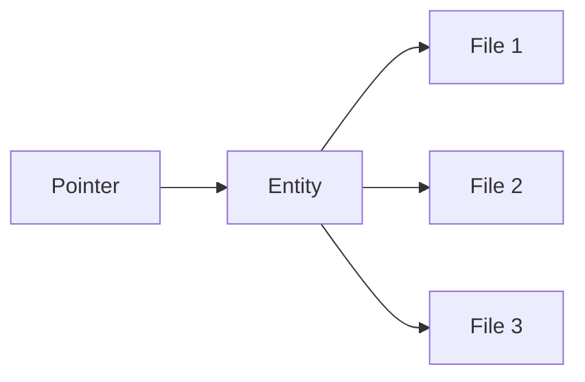

Everything you can find inside the virtual world of Decentraland is hosted on a distributed network of servers known as Catalysts, that provide (among other things) the content API. They are the means by which clients upload and download content.

The complete API of the Catalyst is available in [its own reference](https://decentraland.github.io/catalyst-api-specs/). Here, we'll focus on understanding how content is organized, and how it can be discovered and downloaded.

All of the important concepts mentioned below are further described in their own pages.

## Files, Entities, Pointers

There are three layers in Decentraland's content system: [files](../filesystem.md) are packaged inside [entities](../entities.md), and entities are discovered using [pointers](../pointers.md).

[Files](../filesystem.md) are stored in a decentralized file system resembling IPFS, and automatically synchronized across content servers. They are identified by a unique string ID that is computed from the file's content, and both the identifier and the content are **immutable**. There is no such thing as updating a file. Instead, replacement files are uploaded and stale files are deleted.

[Entities](../entities.md) are atomic packages of files, and represent actual content found in the world, such as scenes and wearable items. They have at least one file, called _manifest_, with a general description and metadata. Just like the individual files they contain, they are immutable and identified by a unique and deterministic string. All entities have an owner, who possesses the private keys required to manage them.

[Pointers](../pointers.md) are stable references that can be resolved to the ID of an entity. When the entity is replaced (i.e. the owner uploads a new package, an the old one is deleted), the contained files and metadata are different and so are their identifiers, but pointers stay the same and are redirected to the new version.

## Snapshots

Content servers also host large newline-delimited-JSON files with summaries of all active entities (i.e. those currently referenced by pointers) at a certain point in time. These are called [snapshots](../snapshots.md), and can be used to explore all available content.
