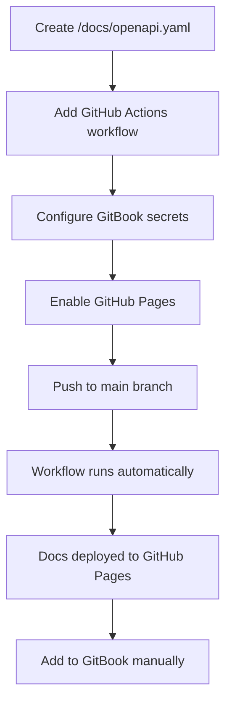
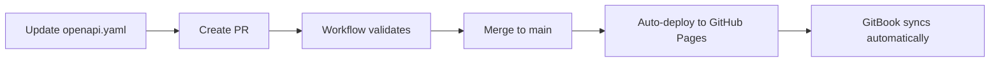

# API Documentation Standards

This page covers standards for documenting APIs using OpenAPI specifications across all Decentraland services.

## Goals

Our API documentation approach ensures:

* **Standardization** - Consistent OpenAPI specs across all services
* **Automation** - Validation, bundling, and deployment via GitHub Actions
* **Centralization** - All service documentation published through GitBook
* **Ownership** - Documentation lives with each service repository
* **Accessibility** - Contributor-friendly, up-to-date API references

---

## Repository Structure

Each service repository MUST include a `/docs` directory with the following structure:

```bash
/docs
  openapi.yaml        # Source of truth (OpenAPI 3.1)
  openapi.json        # Auto-generated in CI for Hugo/renderers
  index.html          # Auto-generated standalone docs (optional)
```

### File Requirements

#### `openapi.yaml`

* **MUST** be the canonical source file
* **MUST** use OpenAPI 3.1 specification
* **MAY** have a service-identifying prefix (e.g., `worlds-openapi.yaml`)
* **MAY** split into `components/` or `examples/` directories if needed

#### `openapi.json`

* Auto-generated during CI/CD
* Used by Hugo and other renderers
* Do not edit manually

#### `index.html`

* Auto-generated standalone documentation
* Built using Redocly
* Deployed to GitHub Pages

---

## OpenAPI Standards

When writing `openapi.yaml`, follow these conventions to ensure consistency and clarity.

### Endpoint Summary

**MUST** reflect the actual endpoint path:

```yaml
# ✅ Good: Clear endpoint path
paths:
  /world/{world_name}/about:
    get:
      summary: /world/{world_name}/about
      description: Retrieves information about a specific world
      
# ❌ Bad: Generic summary
paths:
  /world/{world_name}/about:
    get:
      summary: Get world info
```

### Operation ID

**MUST** include the service name for global uniqueness:

```yaml
# ✅ Good: Service-prefixed operation ID
operationId: worldsContentServer_getWorldAbout

# ✅ Good: Another example
operationId: socialService_getFriends

# ❌ Bad: Generic, could conflict
operationId: getAbout
```

**Naming convention**: `{serviceName}_{operationDescription}`

* Use camelCase
* Be descriptive but concise
* Include HTTP method context when helpful (e.g., `createUser`, `deleteParcel`)

### Versioning

**MUST** use semantic versioning (`MAJOR.MINOR.PATCH`) in `info.version`:

```yaml
openapi: 3.1.0
info:
  title: Worlds Content Server API
  version: 1.2.0  # Semantic versioning
  description: API for managing Decentraland worlds
```

**Version bumping rules**:
* **MAJOR**: Breaking changes (incompatible API changes)
* **MINOR**: New functionality (backward-compatible)
* **PATCH**: Bug fixes (backward-compatible)

### Tags and Grouping

**MUST** use tags to group related endpoints:

```yaml
tags:
  - name: Worlds
    description: World management operations
  - name: Deployments
    description: World deployment operations
  - name: Health
    description: Health check endpoints

paths:
  /worlds:
    get:
      tags:
        - Worlds
      summary: /worlds
      operationId: worldsContentServer_listWorlds
      
  /worlds/{world_name}/about:
    get:
      tags:
        - Worlds
      summary: /worlds/{world_name}/about
      operationId: worldsContentServer_getWorldAbout
```


Operations are grouped by tag in GitBook's navigation. Group related endpoints under the same tag for better organization.


### Complete Example

```yaml
openapi: 3.1.0
info:
  title: Social Service API
  version: 2.1.0
  description: API for managing social interactions in Decentraland
  contact:
    name: Decentraland Contributors
    url: https://decentraland.org

servers:
  - url: https://social.decentraland.org
    description: Production server
  - url: https://social.decentraland.zone
    description: Staging server

tags:
  - name: Friends
    description: Friend management
  - name: Blocked Users
    description: User blocking operations

paths:
  /friends:
    get:
      tags:
        - Friends
      summary: /friends
      operationId: socialService_getFriends
      description: Returns a list of the authenticated user's friends
      parameters:
        - name: limit
          in: query
          schema:
            type: integer
            default: 50
            maximum: 100
        - name: offset
          in: query
          schema:
            type: integer
            default: 0
      responses:
        '200':
          description: Successful response
          content:
            application/json:
              schema:
                type: object
                properties:
                  friends:
                    type: array
                    items:
                      $ref: '#/components/schemas/Friend'
        '401':
          description: Unauthorized

components:
  schemas:
    Friend:
      type: object
      required:
        - address
        - createdAt
      properties:
        address:
          type: string
          description: Ethereum address of the friend
        createdAt:
          type: string
          format: date-time
          description: When the friendship was established
```

---

## Local Development

### Preview Documentation Locally

Use Redocly CLI to preview your OpenAPI documentation:

```bash
# Build HTML documentation
yarn redocly build-docs docs/openapi.yaml -o docs/index.html

# Then open docs/index.html in your browser
```

### Add to package.json

Add a build script for convenience:

```json
{
  "scripts": {
    "build:api": "redocly bundle docs/openapi.yaml -o docs/openapi.json --ext json && redocly build-docs docs/openapi.yaml -o docs/index.html",
    "preview:api": "redocly preview-docs docs/openapi.yaml"
  }
}
```

### Install Redocly CLI

```bash
# Using npm
npm install -g @redocly/cli

# Using yarn
yarn global add @redocly/cli
```

### Validate OpenAPI Spec

```bash
# Validate your spec
redocly lint docs/openapi.yaml

# Bundle and validate
redocly bundle docs/openapi.yaml
```

---

## Automation Setup

### Step 1: Configure GitBook Secrets

To publish API specs to GitBook, add these secrets to your repository:

**Settings → Secrets and variables → Actions → New repository secret**

| Secret Name | Description | Where to Find |
|-------------|-------------|---------------|
| `GITBOOK_ORGANIZATION_ID` | Your GitBook organization ID | GitBook Settings → Organization |
| `GITBOOK_TOKEN` | GitBook API token | GitBook Settings → API Tokens |


These secrets MUST be configured for the automated workflow to publish to GitBook.


### Step 2: Add GitHub Actions Workflow

Create `.github/workflows/build-api-docs.yml` in your repository:

```yaml
name: build-app-docs

on:
  push:
    branches: [main]
    paths:
      - 'docs/**'
  pull_request:
    paths:
      - 'docs/**'

jobs:
  build:
    uses: decentraland/platform-actions/.github/workflows/apps-docs.yml@main
    with:
      api-spec-file: 'docs/openapi.yaml'
      output-file: 'docs/index.html'
      output-directory: './docs'
      api-spec-name: '{service-name}-api'  # e.g., 'social-service-api'
      node-version: '20'
    secrets: inherit
```

**Parameters**:

* `api-spec-file`: Path to your OpenAPI spec (usually `docs/openapi.yaml`)
* `output-file`: Where to generate HTML docs
* `output-directory`: Directory for output files
* `api-spec-name`: Unique name for your API spec (used in GitBook)
* `node-version`: Node.js version to use

**This workflow will**:

1. ✅ Validate the OpenAPI spec
2. ✅ Bundle the spec into a single file
3. ✅ Build static HTML documentation using Redocly
4. ✅ Deploy automatically to GitHub Pages
5. ✅ Publish spec to GitBook (if secrets are configured)

### Step 3: Enable GitHub Pages

Configure GitHub Pages in your repository:

1. Go to **Settings → Pages**
2. Under **Build and deployment**:
   * Set **Source** to **GitHub Actions**
3. Ensure there is an environment named **github-pages**
4. Save settings

After the first successful workflow run, your documentation will be available at:

* **HTML Docs**: `https://decentraland.github.io/<repo>/index.html`
* **OpenAPI Spec**: `https://decentraland.github.io/<repo>/openapi.yaml`
* **Bundled JSON**: `https://decentraland.github.io/<repo>/openapi.json`


These URLs remain valid as long as the repository exists and GitHub Pages is enabled.


---

## Adding to GitBook

Once your API documentation is deployed, add it to the centralized GitBook documentation.

### Manual Addition (Current Process)

1. Navigate to the GitBook space
2. Go to the **API Reference** section
3. Click **Add API Reference**
4. Enter your service details:
   * **Name**: Your service name (e.g., "Social Service")
   * **OpenAPI URL**: `https://decentraland.github.io/{repo-name}/openapi.yaml`
5. Save

### GitBook Integration Features

GitBook will automatically:

* Parse your OpenAPI spec
* Generate interactive API documentation
* Create endpoint navigation based on tags
* Provide "Try it" functionality
* Keep docs in sync when you update the spec

---

## Complete Setup Flow

### Initial Setup



### Ongoing Updates



---

## Best Practices

### Documentation Quality

* **Be descriptive**: Write clear summaries and descriptions
* **Provide examples**: Include request/response examples
* **Document errors**: Describe all possible error responses
* **Use components**: Reuse schemas via `$ref` to avoid duplication
* **Add descriptions**: Every parameter, property, and response should have a description

### Example with Best Practices

```yaml
paths:
  /users/{address}/friends:
    get:
      tags:
        - Friends
      summary: /users/{address}/friends
      operationId: socialService_getUserFriends
      description: |
        Retrieves a paginated list of friends for the specified user.
        Returns friend addresses and metadata including when the friendship was established.
      parameters:
        - name: address
          in: path
          required: true
          description: Ethereum address of the user (0x-prefixed)
          schema:
            type: string
            pattern: '^0x[a-fA-F0-9]{40}$'
          example: '0x1234567890abcdef1234567890abcdef12345678'
        - name: limit
          in: query
          description: Maximum number of friends to return (1-100)
          schema:
            type: integer
            minimum: 1
            maximum: 100
            default: 50
        - name: offset
          in: query
          description: Number of friends to skip for pagination
          schema:
            type: integer
            minimum: 0
            default: 0
      responses:
        '200':
          description: Successfully retrieved friends list
          content:
            application/json:
              schema:
                $ref: '#/components/schemas/FriendsResponse'
              example:
                friends:
                  - address: '0xabcdef...'
                    createdAt: '2024-01-15T10:30:00Z'
                total: 42
                offset: 0
                limit: 50
        '400':
          description: Invalid address format
          content:
            application/json:
              schema:
                $ref: '#/components/schemas/Error'
              example:
                error: 'Invalid address format'
                code: 'INVALID_ADDRESS'
        '404':
          description: User not found
          content:
            application/json:
              schema:
                $ref: '#/components/schemas/Error'
```

### Schema Reusability

```yaml
components:
  schemas:
    Error:
      type: object
      required:
        - error
        - code
      properties:
        error:
          type: string
          description: Human-readable error message
        code:
          type: string
          description: Machine-readable error code
        details:
          type: object
          description: Additional error context
          
    PaginatedResponse:
      type: object
      required:
        - offset
        - limit
        - total
      properties:
        offset:
          type: integer
          description: Number of items skipped
        limit:
          type: integer
          description: Maximum items per page
        total:
          type: integer
          description: Total number of items available
```

### Security Schemas

```yaml
components:
  securitySchemes:
    BearerAuth:
      type: http
      scheme: bearer
      bearerFormat: JWT
      description: JWT token obtained from authentication endpoint

security:
  - BearerAuth: []
```

---

## Validation and Quality Checks

### Pre-Commit Validation

Add a pre-commit hook or CI check:

```yaml
# .github/workflows/validate-api-spec.yml
name: Validate API Spec

on: [pull_request]

jobs:
  validate:
    runs-on: ubuntu-latest
    steps:
      - uses: actions/checkout@v3
      - uses: actions/setup-node@v3
        with:
          node-version: '20'
      - run: npm install -g @redocly/cli
      - run: redocly lint docs/openapi.yaml
```

### Common Validation Rules

* All paths have operation IDs
* All operations have tags
* All parameters have descriptions
* All responses are documented
* Examples are provided
* Schemas are properly referenced

---

## Troubleshooting

### Workflow Fails

**Problem**: GitHub Actions workflow fails

**Solutions**:
* Check workflow logs for validation errors
* Run `redocly lint docs/openapi.yaml` locally
* Verify file paths in workflow configuration
* Ensure secrets are properly configured

### GitHub Pages Not Working

**Problem**: Docs not appearing at GitHub Pages URL

**Solutions**:
* Verify GitHub Pages is enabled in repository settings
* Check that workflow completed successfully
* Wait a few minutes for GitHub Pages to update
* Verify the `github-pages` environment exists

### GitBook Not Syncing

**Problem**: GitBook not showing updated API docs

**Solutions**:
* Verify GitBook secrets are correct
* Check that the OpenAPI URL is accessible
* Manually trigger a refresh in GitBook
* Verify OpenAPI spec is valid

---

## Migration from Existing Docs

If you have existing API documentation:

1. **Export to OpenAPI**: Convert existing docs to OpenAPI 3.1 format
2. **Validate**: Use `redocly lint` to ensure compliance
3. **Add workflow**: Set up GitHub Actions automation
4. **Test**: Verify docs build and deploy correctly
5. **Update links**: Point old documentation links to new GitHub Pages URL
6. **Archive old docs**: Keep old docs for reference during transition

---

## Next Steps

* Review the [Well-Known Components](well-known-components/) standards for API implementation
* See [Testing Standards](testing-standards/) for API testing guidelines
* Check out existing API examples in the [API Reference](https://docs.decentraland.org) section

## Related Standards

* [Dependency Management](dependency-management.md) - Managing npm dependencies and peerDependencies
* [Well-Known Components](well-known-components/README.md) - WKC architecture for services
* [Testing Standards](testing-standards/README.md) - Testing patterns for services

## Resources

* **OpenAPI Specification**: [spec.openapis.org](https://spec.openapis.org/oas/latest.html)
* **Redocly CLI**: [redocly.com/docs/cli](https://redocly.com/docs/cli/)
* **GitBook API Integration**: [docs.gitbook.com](https://docs.gitbook.com)
* **Platform Actions Repo**: [github.com/decentraland/platform-actions](https://github.com/decentraland/platform-actions)

