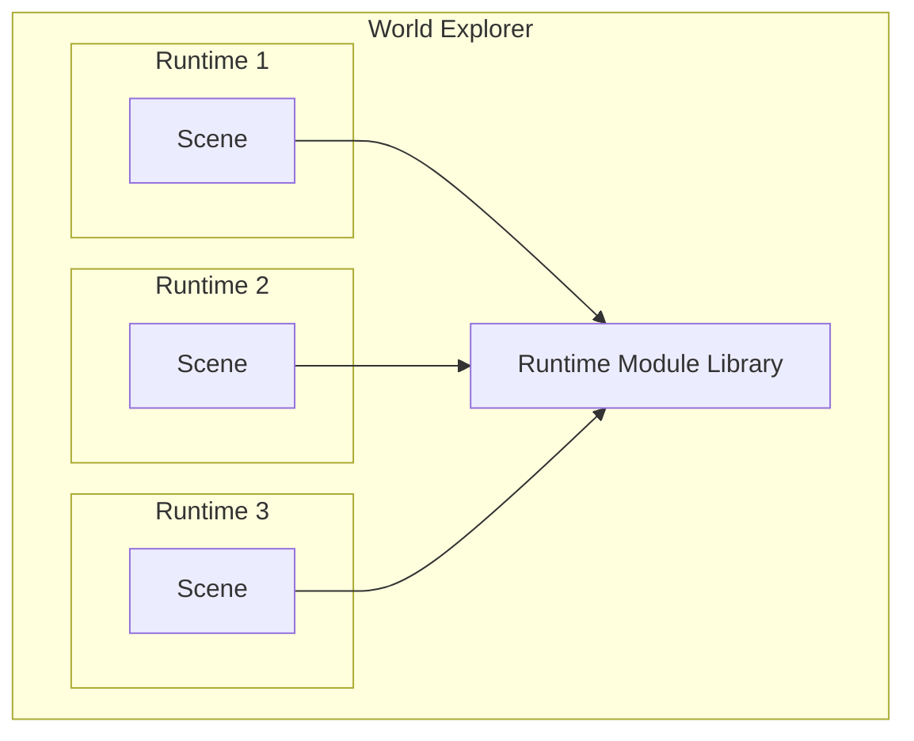

The Decentraland scene runtime is the sandboxed execution environment where a [scene](../../content/entity-types/scenes.md) runs its main script.

Each scene runs inside its own isolated runtime. Within it, it has access to certain [global objects](../globals.md) and can import [modules](../modules.md) from the runtime library.

By importing modules from the runtime library, scenes have access a wide array of functionality, including:

- Create entities and control their behavior
- Interact with the player
- Communicate with other players
- Inspect the state of the world
- Connect to external services
- Make web3 payments

In practice, scenes bundle the [Decentraland SDK](..//creator/sdk7/getting-started/sdk-101.md) with their code, which encapsulates the RPC-style interface of the runtime library and provides a nicer and more comfortable API.


Note that the SDK is _not_ part of the Decentraland protocol, only the lower-level interfaces are. Scenes can decide whether to bundle the SDK or use alternative libraries.


## Global Objects

Inside the sandboxed environment, [scenes](../../content/entity-types/scenes.md) assume certain objects and functions are globally available. Some are standard ES2020 objects (like `Date` or `Math`), and others are injected by the runtime to implement functionality such as requiring modules, logging messages and scheduling callbacks.

Se [globals](../globals.md) for more details.

## Modules

The [`require`](../globals.md#module) global function can import modules provided by the [runtime library](../execution.md). These modules allow selectively importing utilities such as the ECS or Communications systems.

See the runtime modules section for a comprehensive list.

## Execution

The runtime requires that scenes implement a specific set of methods, and guarantees they will be called according to certain rules.

See [execution](../execution.md) for more on this.

## Permissions

Sensitive functionality, such as making HTTP requests to 3rd party services, is restricted by the runtime unless certain permissions are requested by the [scene](../../content/entity-types/scenes.md), and granted by the player.

See [permissions](../permissions.md) to learn more.