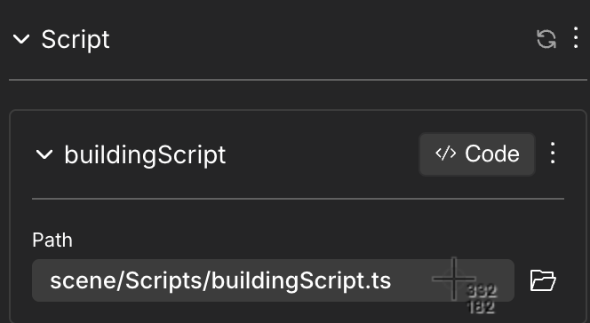
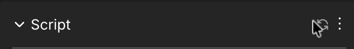
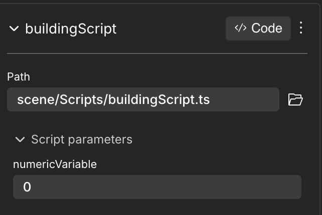
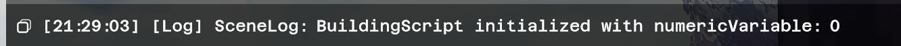
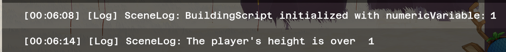

# Script Component

With the new Script Component, it's possible to create Entities that execute custom code from within the entity itself. 

Script Components allow the execution of an Entity's custom behaviour without the need to work directly on the `index.js` and potentially other files.

## Setting up the Script Component

1. Add the Script Component to an Entity by clicking on the `+` button and select it. Create a new Script by clicking on **+ Add New Script Module** and choose a name, or using the File Path (browse or drag and drop an existing file).



2. Clicking on the CODE button in the component will open the default code editor. Let's check its structure. For more details on how to select and manage your default editor, please go to [Combine with code](reference-items.md).


## Understanding the Script structure

When the Script is first opened, it will have the following code:

```ts
import { engine, Entity } from '@dcl/sdk/ecs'

export class BuildingScript {
  constructor(
    public src: string,
    public entity: Entity
  ) {}

  /**
   * Start function - called when the script is initialized
   */
  start() {
    // Script initialization
    console.log("BuildingScript initialized for entity:", this.entity);
  }

  /**
   * Update function - called every frame
   * @param dt - Delta time since last frame (in seconds)
   */
  update(dt: number) {
    // Called every frame
  }
}
```

The class is composed of three main parts:
* The **constructor**, 
* the **start()** method 
* the **update()** method. 

### Constructor

The constructor will contain the parameters you want to expose and modify dynamically from your scene in Creator Hub. 

```ts
export class BuildingScript {
  constructor(
    public src: string,
    public entity: Entity,
    public numericVariable: number, 
  ) {}
...
}
```

Once the file is saved, the **Refresh** button in the Script Component updates all changes done.



Once refreshed, the Script Component will show the `numericVariable` added in the code.



#### Parameters

If different Entities use the same file in the Script component, each will still have independent parameters: if the scene has two buildings, `building1` and `building2`, both with a Script Component pointing at `BuildingScript.ts` file, each building will have their own `numericVariable` parameter that can be modified independently.


**Important Note**: Don't modify/delete `public src: string` and `public entity: Entity`. You can add new ones following them.


The allowed types for the constructor parameters are:
* `Entity`
* `string`
* `number`
* `boolean`


**📔 Note**: Both `public` and `private` constructor parameters are exposed to Creator Hub. The `private` keyword only restricts access within the `BuildingScript` class. For more details, see the official TypeScript documentation on  
[Parameter Properties](https://www.typescriptlang.org/docs/handbook/2/classes.html#parameter-properties).


#### Accessing Parameters inside the Script

To access the value of the parameters in the code, use the notation `this.definedParameter`. For example, `this.numericVariable` or `this.entity`. All Script components have by default in the start() method this line: `console.log("BuildingScript initialized for entity:", this.entity);`. If changed to `console.log("BuildingScript initialized with numericVariable:", this.numericVariable);`, it will log on Console the value set on that parameter in the Creator Hub.

### start() & update() Method

The **start()** method will contain code that is executed only once, when the Entity is created (in this case, when the scene first loads). 

Preview the scene and check the logs (**Tip**: you can use the `` ` `` shortcut): It displays the new message including the `numericVariable` parameter.



The **update()** method, on the other hand, executes its code every frame of the game (as Systems do). For example, checking values of the `PlayerEntity` to trigger behaviours in the script. 

The following code will print Logs every frame of the game that the `PlayerEntity` is higher than the previously defined `numericVariable`, that is selected dynamically from the Script Component UI.

```ts
update(dt: number) {
    if (Transform.get(engine.PlayerEntity).position.y > this.numericVariable ) {
      console.log("The player's height is over ", this.numericVariable);
    }}
```

*  The first log belongs to the start() method, indicating that we set numericVariable. The second one belongs to the update() method, when the player is higher than that value.

## See also

* [Smart items - Basics](../interactivity/smart-items.md)
* [Smart items - Advanced](../interactivity/smart-items-advanced.md)
* [States and conditions](../interactivity/states-and-conditions.md)
* [Making any item smart](../interactivity/make-any-item-smart.md)
* [SDK Quick start](../../sdk7/getting-started/sdk-101.md): follow this mini tutorial for a quick crash course.
* [Development workflow](../../sdk7/getting-started/dev-workflow.md): read this to understand scene creation from end to end.
* [Examples](https://studios.decentraland.org/resources?sdk_version=SDK7): dive right into working example scenes.
